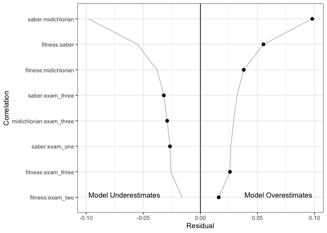
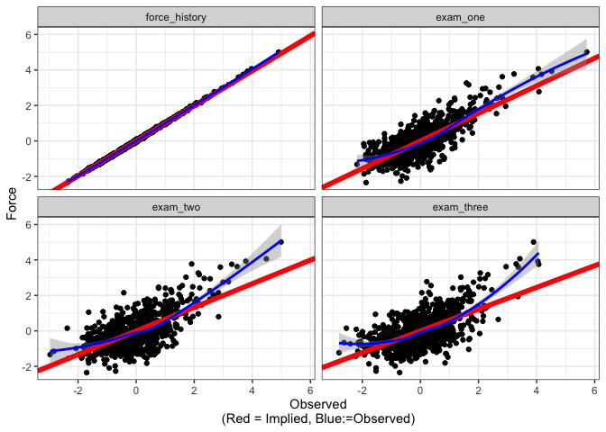
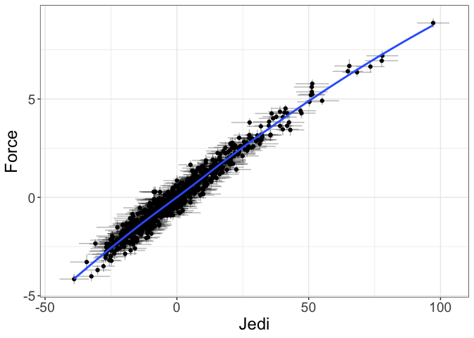

<!-- README.md is generated from README.Rmd. Please edit that file -->

flexplavaan
===========

<!-- badges: start -->

<!-- badges: end -->

SEM is a powerful tool that is infinitely flexible and able to handle
diverse sorts of modeling procedures. However, it has two fatal flaws.
First, latent variables are, by definition, unobserved. As such, data
visualization, a critical component of model building, is not an easy
task. Although some have advocated for the use of scatterplots of latent
variables \[@Hallgren2019\], these plots assume the model has accurately
estimated the parameters, which may or may not be the case. Second,
standard latent variable models are estimated from summary statistics,
such as means and covariances. These summary statistics may be
misleading if model assumptions have been violated (e.g., if the data
are not normally distributed or if relationships are nonlinear).
Although there are SEM tools that allow users to *model* nonnormal data
and nonlinear patterns, few *diagnostic* tools exist that allow users to
assess the degree to which assumptions have been met (and/or whether
violations of these assumptions are problematic).

To overcome both of these limitation, we develop visualization tools
designed for latent variable models. These tools will not only provide
diagnostic checks, but they will allow both researchers and lay
audiences to intuitively understand the fit of latent variable models.

Installation
------------

Currently, there is only a development version of `flexplavaan`. It can
be installed from github using the following command:

    # install.packages("devtools")
    devtools::install_github("dustinfife/flexplavaan")

    # in case the installation fails, set the following option:
    options(timeout=9999999)

Usage
-----

There are five basic plots `flexplavaan` can produce:

1.  Hopper plots. These plots show the residuals from the
    variance/covariance matrix of a structural equation model.
2.  Trace plots. These show pairwise associations between observed
    variables, while overlaying the model-implied fit (much like a
    scatterplot for a regression model).
3.  Disturbance-dependence plots. These are similar to residual
    dependence plots. They show the remaining association between two
    observed variables, once the model-implied fit has been removed.
4.  Measurement plots. These show the relationship between the observed
    variables and the (estimated or predicted) latent variable scores.
5.  Structural plots. These show the relationship between latent
    variables (and/or between endogenous variables).

I’ll show you how to use each of these in the following sections.

### Hopper plots

To show hopper plots, one simply fits a `lavaan` model:

    require(flexplavaan)
    require(lavaan)
    data("jedi_jedi")

    model = "
    Force =~ fitness + saber + midichlorian + force_history
    Jedi =~ exam_one + exam_two + exam_three
    Jedi ~ Force
    "

    # Fit the models ----------------------------------------------------------
    force_fit = sem(model, jedi_jedi)

Next, we can use the `residual_plots` function to generate the hopper
plot:

    # show the hopper plots, only including those variables 
    # that have a residual larger than 0.01
    residual_plots(force_fit, max_val = .01)

The *X* axis shows the absolute value of the residuals on the right and
 − 1× the absolute values on the left. In the above image, we see the
largest residuals are between the saber/midichlorian/fitness variables.

### Trace Plots/Disturbance-Dependence Plots

To visualize trace/DDPs, one simply uses the `visualize` command:

    # trail/ddp of the first 4 variables
    visualize(force_fit, subset=1:4)

In the upper triangle are the trace plots. Here, the blue line shows a
loess line between the two observed variables. (The user can also
specify `visualize(force_fit, method="lm")` to get regression lines).
The red line is the model-implied fit from the model. The lower triangle
shows the relationship between the two indicators, once the
model-implied fit has been removed. The blue line is the loess line (as
before), while the red line is a horizontal line at *y* = 0. The
diagonals show a histogram of the residuals for each variable.

### Measurement Plots

Users can also show the fit between the indicators and the empirical
Bayes factor score estimates:

    # show the measurement plot for the Force latent variable
    implied_measurement(force_fit, latent="Force")
    #> [[1]]

The advantage of measurement plots is they show a larger range of misfit
than do the trace/DDPs. This is because trace/DDPs will only show misfit
if that misfit shows up in bias in estimating the variance/covariance
matrix. Measurement plots, on the other hand, show misfit that shows up
in the estimates of the latent variables themselves.

### Structural Plots

Finally, we have structural plots:

    # show the structural plot for the Force/Jedi latent variables
    visualize(force_fit, plot="latent", formula = Force~Jedi)
    #> Estimating Standard Errors...

The crosshairs highlight the fact that these variables are only
*estimates* of the latent variables. Also, it is important to remember
these plots are only meaningful if the former diagnostic plots check
out. Otherwise, this is much like showing a regression line without raw
datapoints in a regression model.

Obviously, the more latent variables one has, the more complex this plot
could become. The `formula` argument allows users specificity in how
latent variables are displayed. For more information on the syntax of
formulas, see the [flexplot manual](https://psyarxiv.com/kh9c3/).

For more information, see the [flexplavaan
vignette](https://psyarxiv.com/qm7kj).
