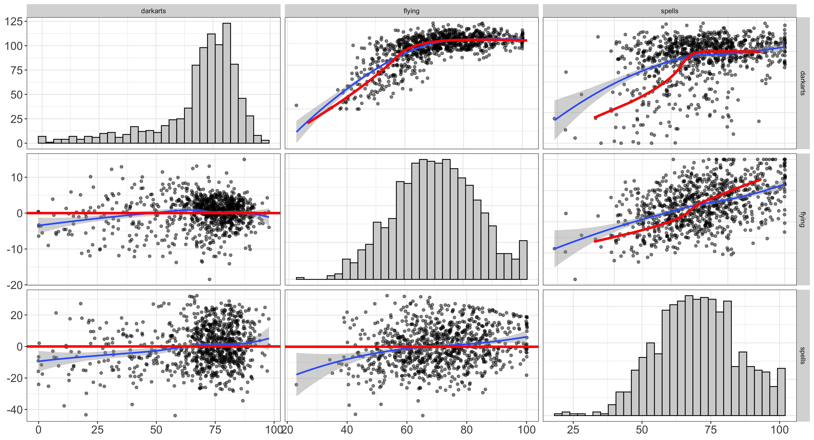

```{r, echo=FALSE, message=FALSE, warning=FALSE}
require(knitr)
require(GGally)
require(flexplot)
require(flexplavaan)
opts_chunk$set(message=FALSE, echo = TRUE, warning = FALSE)
source('R/scratch/archive/ggally_pairs_function.R')
```
# Brief Introduction

SEM is a powerful tool that is infinitely flexible and able to handle diverse sorts of modeling procedures. However, it has two fatal flaws. First, latent variables are, by definition, unobserved. As such, data visualization, a critical component of model building is not an easy task. Although some have advocated for the use of scatterplots of latent variables [@Hallgren2019], these plots assume the model has accurately estimated the parameters, which may or may not be the case. Second, standard latent variable models are estimated from summary statistics, such as means and covariances. These summary statistics may be misleading if model assumptions have been violated (e.g., if the data are not normally distributed or if relationships are nonlinear). Although there are tools that allow users to *model* nonnormal data and nonlinear patterns, few *diagnostic* tools exist that allow users to assess the degree to which assumptions have been met (and/or whether violations of these assumptions are problematic). 

To overcome both of these limitation, we develop visualization tools designed for latent variable models. These tools will not only provide diagnostic checks, but they will allow both researchers and lay audiences to intuitively understand the fit of latent variable models. 

# Diagnostic Plots

## Trail Plots: Estimating the Model-Implied Slope

Suppose we have the factor analysis model shown below.  
```{r, include=FALSE}
#options(tinytex.verbose = TRUE)
#tinytex::tlmgr_install("positioning")
```

<center>
```{r, mod1, engine="tikz", eval=TRUE, echo=FALSE, out.width='50%'}
\usetikzlibrary{arrows}
\begin{tikzpicture}[node distance=2cm, auto,>=latex', thick, scale = 0.5]
\node[draw, circle] (f) {$F$};
\node[draw, rectangle] (x2) [below of=f] {$X_2$};
\node[draw, rectangle] (x1) [left of=x2] {$X_1$};
\node[draw, rectangle] (x3) [right of=x2] {$X_3$};
\draw[->, left] (f) to node {$a$} (x1);
\draw[->] (f) to node {$b$} (x2);
\draw[->, right] (f) to node {$c$} (x3);
\end{tikzpicture}
```
</center>

<br>
Assume both indicators and the latent variable are standard normal variables. 

To make the exercise more illustrative, I have simulated these data:

```{r, first, message=FALSE, warning=FALSE, fig.cap="Scatterplot of the x1/x2 relationship. The red line shows the implied fit between the two variables under the assumption of perfect reliability. The blue line shows the actual fitted relationship."}
require(lavaan)
require(tidyverse)
set.seed(1212)
n = 500
slopes = c(.75, .75, .75)
latent = rnorm(n)

# create three indicators
x1 = slopes[1]*latent + rnorm(n,0, sqrt(1-slopes[1]^2))
x2 = slopes[2]*latent + rnorm(n,0, sqrt(1-slopes[2]^2))
x3 = slopes[3]*latent + rnorm(n,0, sqrt(1-slopes[3]^2))
d = data.frame(x1=x1, x2=x2, x3=x3)
```

We could use the standard SEM machinery to estimate the fit of the model:

```{r}
# model in lavaan
model.linear = '
  A =~ x1 + x2 + x3
  A ~~ A
'
fitted = cfa(model.linear, data=d)
```

Using Wright's tracing rules, we can reproduce the model-implied correlation matrix:

$$
\begin{pmatrix} \begin{matrix}
1 & ab & ac \\
ab & 1 & bc \\
ac & bc & 1
\end{matrix} \end{pmatrix}
$$

Such matrices are standard output in any SEM software, including `lavaan` and `blavaan`. Recall the following relationship between the correlation and the slope,

\begin{equation}
\beta = r \frac{\sigma_Y}{\sigma_X}
\nonumber
\end{equation}

This allows us to calculate the model-implied slope for each bivariate relationship:

\begin{equation}
  E[Y|X] = r_{XY}\frac{\sigma_Y}{\sigma_X}X  
  (\#eq:slopemodimp)
\end{equation}

The above equation is the fit implied by the latent variable model. I call these "trail" plots, because they leave a "trail," or evidence of the presence of the latent variable. Overlaying the result of Equation \@ref(eq:slopemodimp) on the raw data, we get a red line that closely approximates the regression line (blue) between the two variables (Figure \@ref(fig:second)), indicating the model fits well. 
<br>

```{r, second, fig.cap="Scatterplot of the x1/x2 relationship. The blue line shows the actual fitted relationship, while the red line shows the model-implied (trail) fit. "}

  # compute the model-implied slope
implied.cor = lavInspect(fitted, what="cor.ov")
implied.cov = lavInspect(fitted, what="cov.ov")
stdev_ov = sqrt(diag(implied.cov))
estimated.slope = implied.cor["x1","x2"]*(stdev_ov["x2"]/stdev_ov["x1"])

ggplot(data=d, aes(x=x1,y=x2)) +
  geom_point() +
  geom_abline(slope = estimated.slope, intercept=0, col="red") +
  geom_smooth(method="lm") +
  labs(x="Exam One", y="Exam Two") +
  theme_bw()
```


We could also visualize all observed variables in a scatterplot matrix (using, say, the upper diagonal), as in Figure \@ref(fig:third). Here, I am utilizing the `visualize` function in the `flexplavaan` package.  As before, the red line indicates the model-implied fit. This time, however, the blue line is the fit of a loess line (which will allow for the detection of nonlinear patterns). Notice the two lines in each plot are quite similar (as they should be because these are simulated data).  


```{r, third, echo=FALSE, fig.cap="Scatterplot matrix of the indicator variables. As before, the red line shows the implied fit between the two variables and the blue line shows the actual fitted relationship (measured via loess lines). "}
require(flexplavaan)
visualize(fitted, plot = "model", sample=300)
```


## Disturbance Dependence Plots: Removing the Effect of the Latent Variable

It may also be interesting to utilize "disturbance dependence plots," or to plot the relationship between the observed variables on interest, once the effect of the latent variable(s) have been removed. This is similar to a residual dependence plot in regression models, but we use different terminology to avoid confusion (since residuals in SEM often refer to the residual correlation matrix). 

To generate these disturbance terms, we need only to generate predicted $Y$ scores from Equation \@ref(eq:slopemodimp) for each individual, then subtract those from the observed $Y$ scores. We can then plot the relationship between $Y$ and $X$ after removing the effect of the latent variable. If the data are locally independent, we should observe no relationship. The expected relationship (i.e., a line centered on zero with no slope) is colored as red. We could then add this plot to the scatterplot matrix as in Figure \@ref(fig:five). The default for the visualize function displays the model-implied (trail) plots in the upper triangle and the disturbance dependence plots in the lower triangle. As expected (because the data were simulated), the loess lines in the lower triangle are very similar to the model-implied line (i.e., the line where $Y$=0). 


```{r, five, echo=FALSE, fig.cap="Scatterplot matrix of the indicator variables. The upper triangle show the model-implied fit between the indicators, while the lower triangle shows the disturbance dependence plots. As before, the red line shows the implied fit between the two variables and the blue line shows the actual fitted relationship (measured via loess lines). "}
visualize(fitted, sample=300)
```


## Detecting Cross-Loadings

These diagnostic plots are designed to detect deviations from the model's implied relationship. In the next example, I'm going to utilize a simulated dataset of jedi training, where two latent variables are posited (force and jedi), each with 3 indicators (fitness, saber, midichlorian for force and exam one, exam two, and exam three for jedi). In addition, one variable (history) has cross loadings on both factors. However, I will fit a model where history is only modeled on the force latent variable, then subsequently fit a model where the variable loads on both latent variables. 

<br>
```{r, force, engine="tikz", eval=TRUE, echo=FALSE, out.width='80%', fig.cap="Simulated dataset with crossloadings on the 'history' indicator."}
\usetikzlibrary{arrows}
\begin{tikzpicture}[node distance=2cm, midway]

\node[draw, circle] (force) {Force};
\node[draw, circle, node distance = 2cm] (jedi) [right of=force] {Jedi};

\node[draw, rectangle] (saber) [left of=force] {Saber};
\node[draw, rectangle, node distance = 1cm] (fit) [above of=saber] {Fitness};
\node[draw, rectangle, node distance = 1cm] (midi) [below of=saber] {Midichlorian};

\node[draw, rectangle] (hist) [below of=jedi] {History};

\node[draw, rectangle] (e2) [right of=jedi] {Exam II};
\node[draw, rectangle, node distance = 1cm] (e1) [above of=e2] {Exam I};
\node[draw, rectangle, node distance = 1cm] (e3) [below of=e2] {Exam III};

\draw[->] (force) to node [fill=white]{\tiny $b$} (saber);
\draw[->] (force) to node [fill=white]{\tiny $a$} (fit);
\draw[->] (force) to node [fill=white]{\tiny $c$} (midi);

\draw[->] (jedi) to node [fill=white]{\tiny $d$} (e1);
\draw[->] (jedi) to node [fill=white]{\tiny $e$} (e2);
\draw[->] (jedi) to node [fill=white]{\tiny $f$} (e3);

\draw[->] (jedi) to node [fill=white]{\tiny $g_1$} (hist);
\draw[->] (force) to node [fill=white]{\tiny $g_2$} (hist);

\draw[->] (force) to node [fill=white]{\tiny $\beta$} (jedi);
\end{tikzpicture}
```
<br>

```{r, sixth, echo=FALSE, fig.cap="Scatterplot matrix of the indicator variables, but this time with local dependence between x1/x2 and a nonlinear relationship between the latent variable and x3. As before, the red line shows the implied fit between the two variables and the blue line shows the actual fitted relationship (measured via loess lines). ", fig.width=4, fig.height=3}
require(lavaan)
require(flexplot)
require(tidyverse)
data(jedi_jedi)

# specify the models ------------------------------------------------------
model = "
force_score =~ fitness + saber + midichlorian + force_history
jedi_score =~ exam_one + exam_two + exam_three
jedi_score ~ force_score
"
## specify model
model_cross = "
force_score =~ fitness + saber + midichlorian + force_history
jedi_score =~ exam_one + exam_two + exam_three + force_history
jedi_score ~ force_score
"
# Fit the models ----------------------------------------------------------
force_fit = cfa(model, jedi_jedi)
force_cross = cfa(model_cross, jedi_jedi)
```

The table below shows the result of both models and various measures of fit. If one were not to fit the second model, it would be unclear where the misfit occurs. One could, of course, study modification indices, but they have a multitude of problems. One could also study the residual matrix, but even these have their limitations. They only signal which correlations (or covariances) are poorly fit, but do not give much more information about how to improve the model. 

```{r, echo=FALSE, message=FALSE, results='hide'}

sink("/dev/null");
keep = c("chisq", "df", "pvalue", "cfi", "tli", "bic", "rmsea", "srmr")
fits_one = invisible(summary(force_fit, fit.measures=TRUE, header=FALSE, estimates=FALSE)[[1]])[keep]
fits_cross = summary(force_cross, fit.measures=TRUE, header=FALSE, estimates=FALSE)[[1]][keep]
results = data.frame(cbind(fits_one, fits_cross)) %>% 
  setNames(c("No Crossloadings", "Crossloadings Included"))
sink()
```

```{r, fits, echo=FALSE, message=FALSE, results="asis"}
results[2,] = round(results[2,])
row.names(results) = c("$\\chi^2$", "df", "p", "CFI", "TLI", "BIC", "RMSEA", "SRMR")
#keep = c("chisq", "df", "pvalue", "cfi", "tli", "bic", "rmsea", "srmr")
knitr::kable(t(results), 
             row.names=T,
             digits = c(1,0,4,2,2,1,2,2),
             caption = "\\label{tab:fits} Fit Indices for Two Models, One Where the Crossloadings Are Included and One Where They Are Not."
    )
```

Instead of looking at global fit indices as in Table \@ref(tab:fits), the data could be plotted, as they are in Figure \@ref(fig:cross). Here I am only plotting the variables associated with the second latent factor (Jedi). Also, supplying two models to the `visualize` function will show different lines for each model. This graphic makes it very apparent where the misfit comes from. Notice that the entire first row of model plots (upper triangle) show consistent underestimation for the model titled `Model 1` (which is the model without crossloadings). On the other hand, the correctly specified model (`Model 2`) shows excellent fit. 


```{r, cross, fig.cap="Model-implied trail plots (upper triangle) and disturbance-dependence plots (lower triangle) for the jedi dataset. "}
visualize(force_fit, force_cross,     ## two models to compare
    subset=4:7,                       ## which columns of the matrix to viz
    sample=300, suppress_smooth=T)    ## options passed to flexplot
```


# Visualizing Measurement Models

Once the diagnostic plots indicate the model fits, one can be more confident the factor scores are accurately estimated. At that point, the user may choose to visualize the measurement model. Unfortunately, even four indicators (as we have here) are tricky to visualize; if one were to plot each variable as a separate dimension, five dimensions would be required to produce the graphic (one for each observed variable and one for the latent variable). An alternative is to do the following:

1. Convert each observed variable to the same scale (e.g., with mean of zero and standard deviation of one).
2. Convert from wide to long format.
3. Place observed (scaled) scores on the X axis, the latent variable on the Y axis, and the observed indicators as separate panels. 

For these data, we might use the following code, which utilizes `flexplot` to produce the graphic. As illustrated in the plot, the relationship between each variable and the outcome is about equally strong (though midichlorian has the strongest). 

```{r, measurement, fig.cap="Visual representation of the measurement model for the jedi dataset. Blue lines are the regression lines between the observed variable (X axis) and the factor scores (Y axis). The red lines are ghost lines, which repeated the pattern from one panel (the midichlorian panel) to the others for easier comparison.", fig.width=6, fig.height=4}
# extract factor score estimates
jedi_jedi[,c("force", "jedi")] = lavPredict(force_cross)
# convert to long format
force_model = jedi_jedi %>% 
  mutate_at(vars(fitness:midichlorian), scale) %>% # convert to standardized variables
  gather(key="Measure", value="Observed", fitness:midichlorian) # convert to long format
# plot it
flexplot(jedi~Observed | Measure, 
         data=force_model, 
         method="lm", 
         ghost.line = "red")
```

Of course, one could also produce a scatterplot of the latent variables, which is trivially easy to do using `flexplot`, as shown in Figure \@ref(fig:structure). 


```{r, structure, fig.cap="Visual representation of the structural model for the jedi dataset. The blue line is the regression line between the two latent variables. "}
flexplot(jedi~force, data=jedi_jedi, method="lm")
```


# Nonlinear Relationships

In the previous sections, I demonstrated how various visuals can be used to diagnose latent variable models. Recall that SEMs assume all relationship are linear. If the relationships are not linear, the diagnostic plots will quickly highlight nonlinearities. 

To illustrate the ability of `flexplavaan` to detect nonlinearities, I will use a dataset generated from the model shown in Figure \@ref(fig:nonlinear). This model attempts to predict which students at Hogwarts survive the final battle against the Death Eaters using students' scores in the O.W.L.'s (standardized magic tests). This model posits there are two latent variables: skills and knowledge, each measured with three observed variables. The model then utilizes these latent variables to predict who survives. Notice the nonlinear paths (e.g., from darkarts to skills and from skills/knowledge to survival). In each case, the relationships were simulated to be logistic.   

<center>
```{r,nonlinear, engine='tikz', eval=TRUE, echo=FALSE, out.width='80%', fig.cap="Simulated dataset with nonlinear relationship. \\label{fig:nonlinear}"}
\begin{tikzpicture}[node distance=2cm, midway, minimum width=1.75cm]

\node[draw, circle] (know) {Knowledge};
\node[draw, circle, node distance = 3cm] (skills) [below of=know] {   Skills   };
\node[node distance = 3cm] (blur) [left of=know] {};
\node[draw, rectangle, node distance = 2cm] (surv) [below of=blur] {Survival};

\node[draw, rectangle, node distance = 4cm] (potions) [right of=know] {Potions};
\node[draw, rectangle, node distance = 1cm] (hist) [above of=potions] {History};
\node[draw, rectangle, node distance = 1cm] (herb) [below of=potions] {Herbology};

\node[draw, rectangle, node distance = 4cm] (spells) [right of=skills] {Spells};
\node[draw, rectangle, node distance = 1cm] (fly) [above of=spells] {Flying};
\node[draw, rectangle, node distance = 1cm] (dark) [below of=spells] {Darkarts};


\draw[->] (know) to node {} (hist.west);
\draw[->] (know) to node {} (potions.west);
\draw[->] (know) to node {} (herb.west);


\draw[->] (skills) to node {} (spells.west);
\draw[->] (skills) to node {} (fly.west);
\draw (skills)  edge[out=350, in=180,->] (dark.west);

\draw[shorten >=1.5mm] (skills)  edge[out=180, in=350,->] (surv.east);
\draw[shorten >=1.5mm] (know)  edge[out=180, in=40,->] (surv.east);

\end{tikzpicture}

```
</center>


If we were to fit these data with standard SEM machinery, `flexplavaan` clearly highlights the nonlinearities present in the data (Figure \@ref(fig:hogwarts)). While the first three indicators (potions, history, and herbology) appear to fit well, the indicators of the latent skill variable demonstrate strong nonlinear patterns. Most strikingly, the darkarts/flying relationship is quite nonlinear. (This is expected since flying was chosen to have a large factor loading and darkarts has the nonlinear relationship with the latent variable). 


```{r, hogwarts, fig.cap="Diagnostic plots of the Hogwarts dataset. Notice how `flexplavaan` is able to detect nonlinearities from latent to observed variables using only the observed variables. ", fig.width=8, fig.height=8}
# fit/visualize using standard lavaan -------------------------------------
data("hogwarts_survival")
model = "
magic_knowledge =~ potions + history + herbology
magic_skills =~ spells + darkarts + flying 
magic_skills ~ magic_knowledge
"
hogwarts_fit = lavaan::sem(model, data=hogwarts_survival)
visualize(hogwarts_fit, method="loess", sample=300)
```


## Bayesian Estimation of Nonlinear Relationships

Figure \@ref(fig:hogwarts) suggests we need to modify the model. Unfortunately, for complex nonlinearities such as that in the Hogwarts dataset, modeling and visualizing these nonlinear relationships is quite complicated. To fit the model, standard SEM cannot be used because it assumes linear relationships. Granted, one may utilize WLS with threshold models, but there are not actually modeling the nonlinearity. Rather, they are "tricking" SEM into handling the nonlinearity. 

A better approach is to utilize Bayesian SEMs (BSEMs). BSEMs are not limited to normally distributed variables or linear relationships. However, the learning curve associated with BSEMs is quite steep. Users must have familiarity with JAGs, STAN, or something similar. However, the `blavaan` package makes BSEMs far more accessible because it allows users to write standard `lavaan` syntax, then exports JAGs (or STAN) code to make it easier for the user to modify the model. The user can then run the JAGs (or STAN) code directly to estimate the model. 

For example, for the Hogwarts dataset, we can run the following code, which will export the JAGs syntax:

```{r, eval=FALSE}
require(blavaan)
  # export the model in JAGs syntax
fit.bayes.export = bsem(model, data=hogwarts_survival, 
                              # name of folder where JAGs syntax is stored
                        mcmcfile="hogwarts_survival", 
                        target="jags",
                              # the following lines shortened the MCMC because
                              # I only need the syntax
                        n.chains = 1,
                        burnin = 1,
                        sample = 2, 
                        adapt=1)
```

Once I have the JAGs code, I can modify the model with the new relationships. 

```{r, eval=FALSE}
model {
  for(i in 1:N) {
    ...
    #surv[i] ~ dnorm(mu[i,7], 1/psi[3,3,g[i]])   #old code
    survived[i] ~ dbern(mu[i,7])                 #new code
    ...
  }  
  # mu definitions
  for(i in 1:N) {
    ...
    #mu[i,5] <- nu[5,1,g[i]] + lambda[5,2,g[i]]*eta[i,2]  # old code
    mu[i,5] <- mx/(1 + exp(-1*lambda[5,2,g[i]]*
                             (eta[i,2] - nu[5,1,g[i]])))  # new code
    ...
    #mu[i,7] <- alpha[3,1,g[i]] + 
    #    beta[3,1,g[i]]*eta[i,1] + beta[3,2,g[i]]*eta[i,2]  # old code
    logit(mu[i,7]) <- alpha[3,1,g[i]] + 
      beta[3,1,g[i]]*eta[i,1] + beta[3,2,g[i]]*eta[i,2]     # new code
    ...
  }

  # Assignments from parameter vector & equality constraints
    ...
  mx <- parvec[24]           # new code
    ...
  # Priors
    ...
  parvec[24] ~ dunif(20, 100)    # new code
}
```

With this file, I can then run the model using JAGs directly, with some modification to the JAGS dataset. Also, it is essential that I tell JAGS to monitor the latent variable(s) (`eta` in this case). The estimates of `eta` will be critical for developing the model-implied fit. 

```{r eval=FALSE}
load("hogwarts_survival/semjags.rda")
# add variables to the jags dataset based on the modified model
jagtrans$data$mx = NA
jagtrans$data$survived = hogwarts_survival$survived
jagtrans$data$surv = NULL
# have JAGS monitor the latent variables
jagtrans$monitors = c("mx", jagtrans$monitors, "eta") ### monitor the latent variable
# fit the model
hogwarts_nonlinear <- run.jags("hogwarts_survival/sem_nonlinear.jag", 
                                 monitor = jagtrans$monitors,
                                 data = jagtrans$data, 
                                 method = "parallel")
```

Unfortunately, when users build custom JAGs models, they no longer are `lavaan` objects as they are when using "out of the box" estimation from `blavaan`. Fortunately, visualizing these models is only marginally more difficult for the *user*. However, the mathematics of developing these visuals is far more complex than with linear models. In the following section, I will discuss how I developed an approximation to the model-implied fit between indicator variables. 

## Model-Implied Fit Using Factor Scores

Recall that we developed the model-implied fit by converting the model-implied correlations to slopes and scaling by the observed variables. Unfortunately, with nonlinear relationships, correlations cannot be trusted. Instead, a different approach is required to estimate the model-implied fit. While one could, presumably, obtain an exact answer to the model-implied fit by using the mathematical relationships themselves, this approach would be quite cumbersome for all but the most simple of equations. In addition, this approach would require extensive mathematical expertise on the part of the user. 

Alternatively, because the factors scores (`eta`) are already estimated as part of the modeling process, these factor scores can be used to develop a model-implied fitted line. To illustrate this approach, we first start with a linear example. The first step is to model the fit between the estimated factors scores and the two observed variables of interest. For example,

\begin{align}
\nonumber \hat Y &= b_{0y} + b_{1y} F \\
\nonumber \hat X &= b_{0x} + b_{1x} F 
\end{align}

These equations yield model-implied estimates for both $Y$ and $X$. One could then plot $\hat X$ against $\hat Y$ to obtain a model-implied fitted estimate. However, this fitted estimate actually shows the fit between $\hat X$ and $\hat Y$, not between $X$ and $Y$. The fit between $\hat X$ and $\hat Y$ will actually inflate the strength of the relationship between $X$ and $Y$ because any unreliability in $X$ and $Y$ will be removed. As such, the relationship between $\hat X$ and $\hat Y$ needs to be weakened proportional to the reliability of each indicator:

\begin{align}
\nonumber \hat Y &= b_0 + b_1\times B \\
\nonumber        &= b_0 + b_1\times \sqrt{\rho_{YY}\rho_{XX}} \times \hat B
\end{align}

Figure \@ref(fig:modelimplied) demonstrates the utility of this correction for a linear function. The red line shows the model-implied fit and the blue line is the best fitting loess line. 

```{r, modelimplied, fig.cap="A second way of estimating the slope between observed variables. The red line shows the model-implied fit that was computed via the estimated factors scores, corrected for reliability. ", fig.width=4, fig.height=4}
# create "pure" measures of X/Y, predicted from factor scores
d$factor.scores = as.numeric(lavPredict(fitted))
d$model.implied.x = predict(lm(x1~factor.scores, data=d))
model.implied.y = predict(lm(x2~factor.scores, data=d))

# estimate reliability
rxx = 1-coef(fitted)["x1~~x1"]
ryy = 1-coef(fitted)["x2~~x2"]

# correct X/Y relationship
d$model.implied.y.corrected = sqrt(rxx*ryy)*model.implied.y

# plot relationship
flexplot(x2~x1, data=d) +
  geom_line(aes(model.implied.x, model.implied.y.corrected), col="red")

```

## Estimating Reliability and Fit For Nonlinear Relationships

The previous example demonstrated that using reliability information and regression models, one could derive the model-implied fit from the factor scores. This becomes more tricky with nonlinear relationships for a few reasons. First, one cannot use regression models to estimate the fitted line. Second, is is unclear how to estimate reliability for nonlinear models. Third, even if one could estimate reliability, it is not clear how one can provide a general solution to weaknening this relationship proportional to the reliability. 

To address the first concern (that one cannot use linear models to estimate the map from latent to observed), we can utilize one of many nonparametric smoothing functions, such as loess lines, splines, median smoothing, etc. For this example, we will utilize smoothing splines with built in cross-validation. Within the Hogwarts dataset, we can fit the nonlinear relationship between darkarts and the latent score, where the latent score has been estimated from the JAGs model. This fit is shown in Figure \@ref(fig:splined). 

```{r, splined, fig.cap="A scatterplot showing the relationship between the latent variable and the observed darkarts and flying variables. The red lines show the smoothed spline fit, an approximation of the model-implied fit. "}
# read in the JAGs output
hogwarts_JAGs = readRDS(file="data/hogwarts_summary.rds")

# extract latent scores from JAGs model (using flexplavaan)
factor.scores = flexplavaan::export_jags_latents(hogwarts_JAGs)[,-1]
hogwarts_survival[,c("knowledge", "skill")] = factor.scores

# estimate fit between the indicators and factors
dark_fit = smooth.spline(x = hogwarts_survival$skill, 
                         y = hogwarts_survival$dark, cv = TRUE)
survival_fit = smooth.spline(x = hogwarts_survival$skill, 
                         y = hogwarts_survival$flying, cv = TRUE)
newy = data.frame(x=dark_fit$x, y = dark_fit$y)
newx = data.frame(x=survival_fit$x, y = survival_fit$y)


# plot results of spline
a = flexplot(darkarts~skill, data=hogwarts_survival, suppress_smooth = T) +
  geom_line(data=newy, aes(x,y), col="red")
b = flexplot(flying~skill, data=hogwarts_survival, suppress_smooth = T) +
  geom_line(data=newx, aes(x,y), col="red")
cowplot::plot_grid(a,b)
```

We can also use a similar procedure to estimate the reliability. Recall that reliability is defined as 

$$
\frac{\sigma^2_T}{\sigma^2_X}
$$

Or true score variance divided by observed variance. If we treat the fitted line as the true score, we can then define the reliability as

$$
\frac{\sigma^2_{\hat X}}{\sigma^2_X}
$$

The R code below shows how to compute this in R. 

```{r}
rho_xx = var(newx$y)/var(hogwarts_survival$flying)
rho_yy = var(newy$y)/var(hogwarts_survival$darkarts)
```

Now that we have a way to approximate the functional relationship between the latent variable(s) and the indicators and have an estimate of the reliability, the final problem to tackle is how to attenuate the strength of the relationship between the latent and observed variables Again, we seek a general solution that does not require one to know which nonlinear parameters control the "slope" of the relationship.

One potential approximation would be to regress the predictions of the model closer to the mean of the $Y$ variable, proportional to the product of the reliabilities. In other words:

$$
\hat Y' = \bar Y + \sqrt{r_{YY}r_{XX}}\times (\hat Y - \bar Y)
$$

where $\hat Y'$ indicates the attenuated (corrected) estimate for $\hat Y$. Once these are corrected, we can finally plot the model-implied fit between the observed variables, as well as the disturbance-dependence plot. 


```{r}
# attenuate the relationship
newxy = data.frame(darkarts=newy$y, flying=newx$y)
newxy$darkarts_prime = mean(hogwarts_survival$darkarts) + 
  sqrt(rho_xx*rho_yy)*(newxy$darkarts - mean(hogwarts_survival$darkarts))

# attenuate residuals
fitted_y = mean(hogwarts_survival$darkarts) + 
  sqrt(rho_xx*rho_yy)*(fitted(dark_fit) - mean(hogwarts_survival$darkarts))
hogwarts_survival$darkarts_residuals = hogwarts_survival$darkarts - fitted_y

# plot results
fitted = flexplot(darkarts~flying, data=hogwarts_survival) +
  geom_line(data=newxy, aes(flying, darkarts_prime), col="red")
residuals = flexplot(darkarts_residuals~flying, data=hogwarts_survival) +
  geom_hline(yintercept = 0)
cowplot::plot_grid(fitted, residuals)
```


Much of the above programming is simply to demonstrate how `flexplavaan` is estimating the model-implied fits. Most of the programming is handled in the background, much as it was with linear models. To display the scatterplot matrices as before, we can use the same function (`visualize`), though we need to also specify the dataset and (at present) identify the latent variable(s) with which each observed variables is associated.


```{r, finalmod, eval=FALSE}
data("hogwarts_survival")
require(flexplavaan)
hogwarts_nonlinear = readRDS(file="data/hogwarts_summary.rds")
visualize.runjags(hogwarts_nonlinear, data[,4:6], which.latent=c(2,2,2))
```



Figure \@ref(fig:finalmod) shows that the approximation works fairly well. Though there is *some* misfit evident in the disturbance-dependence plots, for the most part, the approximation captures the essential features of the nonlinear relationships. 

# Questions and Future Directions
First, a question: how difficult would it be to modify `blavaan` such that it allows user-specified functional relationships? For example:

```{r, echo=TRUE, eval=FALSE}
model = '
# x1 has a logistic relationship with F1
F1 = x1 + x2 + logit(x3)
# x4/x5 have nonlinear relationships
F2 = (a*x4)/(b+x4) + exp(x5) + x6

x3~~x3:dbern  #x3 is bernoulli distributed
x4~~x4:dgamma #x4 is gamma distributed
x5~~x5:dpois  #x5 is poisson distributed
'
```

I know you mentioned that these sorts of modification will screw up the estimation of fit indices (which rely on a normal likelihood). Can `blavaan` be modified to only report fit indices that make sense in this case? I know not having fit indices might be limiting, but the user would still be able to visualize the fit (which is, arguably, more important than the fit indices). 

Also, there are a couple of features I need to add to `flexplavaan`. First, it works quite well if one is visualizing a small number of observed variables (e.g., 3-7). Any more than that becomes visually overwhelming. In the near future, I plan to add the ability of the `visualize` function to plot the variables most poorly fit. To do so, I think I will compute the median misfit in the residual correlation matrix for each variable, then plot the 3-7 variables with the largest medians. This will, ideally, help the user to hone in on areas of local misfit without providing an overwhelming amount of information.

Finally, the way I currently handle the JAGs models is a bit clunky. Ideally, `blavaan` can be modified to allow nonlinearities. If not, I'll modify the `visualize` function to extract the data and map latent variables onto observed variables (so the user doesn't have to provide this information).

That aside, I look forward to your feedback. 

Thanks!


\pagebreak 

# References
