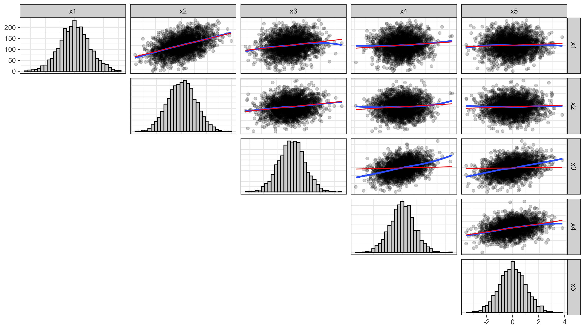
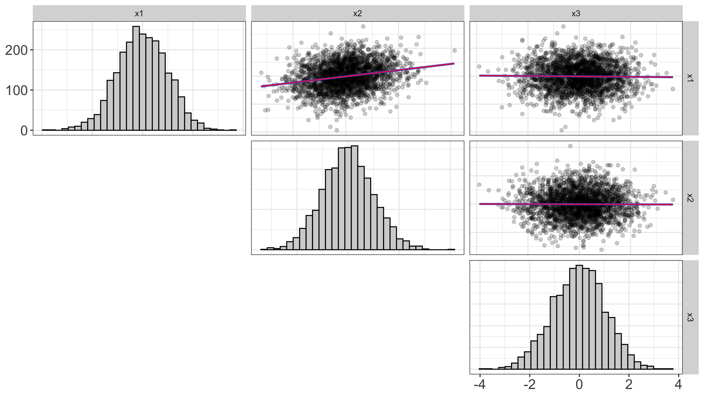
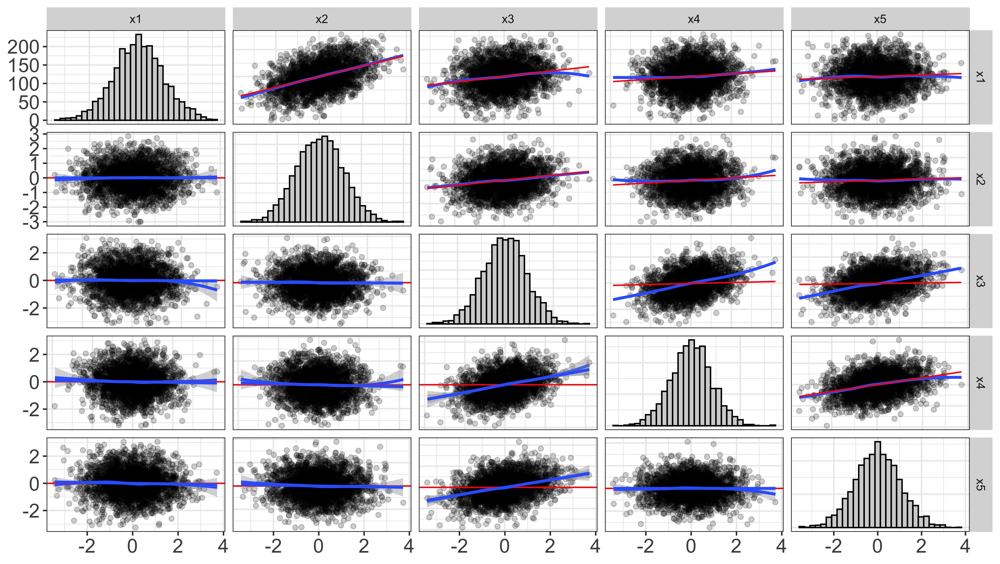

```{r setup, include=FALSE, message=FALSE, warning=FALSE, note=FALSE}
knitr::opts_chunk$set(echo = FALSE, message=FALSE, warning=FALSE, note=FALSE)
require(tidyverse)
```

# Introduction
It is currently an unprecedented time in the social sciences; multiple scientific disciplines are reeling from a "replication crisis" [@Camerer2018; @Ioannidis2005; @Pashler2012a], new norms for credibility are becoming more prevalent (Nelson, Simmons, & Simonsohn, 2018; Nosek, Ebersole, DeHaven, & Mellor, 2018), and the push for open science is accelerating at a rapid pace [@Nosek2018]. Amidst this push for open science practices, some have called for greater use of visualization techniques [@Fife2019a; @Fife2019e; @Tay2016a]. As noted by Tay, et al. (2016), "[visualizations]...can strengthen the quality of research by further increasing the transparency of data..." (p. 694). In other words, one of the best, and most efficient ways of making data analysis open and transparent is to display each and every datapoint through visualization techniques. [SMB suggested addition: This is particularly important in research applications where participant-level data cannot be shared.]

Not only do visualizations adhere to the principles of openness and transparency, but they offer several additional advantages; they vastly improve encoding of information [@Correll2015], they highlight model misfit [@Healy2014a], and they are an essential component in evaluating model assumptions [@Levine2018; @Tay2016a]. As such, we [as well as others, e.g., @Fife2019b; @Fife2019e; @Wilkinson1999a] insist that every statistical model ought to be accompanied by a graphic. 

Unfortunately, this visualization requirement is easier said than done. While visualizing some statistical models is trivial (e.g., regressions, t-tests, ANOVAs, multiple regression), visualizing others is not. One particularly troublesome class of models to visualize is latent variable models (LVMs). While researcher routinely visualize conceptual models (e.g., via path diagrams), visualizing the statistical models is not so easy. The former visualizations are common, while the latter are not [@Hallgren2019a]. The reason statistical visualizations of LVM are not intuitive is because they rely on unobserved variables [@bollen_structural_1989]. If the variables of interest are unobserved, how can we possibly visualize them? 

Though it is not, at first glance, easy to visualize unobserved variables, that does not mean visualizing them is any less important. On the contrary, visualizing latent variables is, perhaps more important because their presence is unobserved. In the following section, we elaborate on why visualizations are particularly crucial for LVMs. We then review previous approaches others have used for visualizing LVMs, and note their strengths and weaknesses. We then introduce our approach and the corresponding R package flexplavaan, which allows users to visualize both lavaan and blavaan objects in R. We then conclude with several examples that highlight how visualizations assisted in identifying appropriate statistical models. 

# Why Visualizations are Critical for LVMs 
As SEM is generally used to test causal theoretical models, accurate model specification is vital. Model misspecifications in any one feature of the model can lead to potentially serious biases throughout the systems of equations. For example, model misspecifications in the measurement portion of the model can lead to biased estimates of structural parameters. SEM practitioners generally rely on global fit tests and approximate fit indices when evaluating model adequacy rather than visual inspection of the statistical model (Bollen & Arminger, 1991; Yuan & Hayashi, 2010). Global fit indices are highly valuable in that they can alert the modeler of discrepancies between the model-implied and observed covariance matrices. However, problematic model implications may be masked by global indices. Furthermore, in our experience, applied users often lack an intuitive understanding of what global fit statistics tell them about the model. Rather than using these indices to identify  problematic model features, there is a tendency to use conventional thresholds (e.g., Hu & Bentler, 1999); a practice that has received much criticism (Chen et al.; Hayduk; McIntosh). Visualizations showing patterns of misspecification would likely help users better understand why their proposed models depart from the observed data and implement remedial strategies, as appropriate. 

Recognizing the limitations of global fit indices, a number of scholars have emphasized supplementing with local fit evaluation. Modification indices (MIs) help identify which model constraints would improve fit most if they were to be freely estimated. However, MIs cannot detect all major model misspecifications (e.g., missing latent variables). Residual covariance matrices can help identify individual model features that are inconsistent with the data, but detecting a pattern of misspecifications is not straightforward using this approach. The causal structural modeling (CSM) approach emphasizes mathematical identification of causal effects prior to model specification and evaluating whether all implications of the model (e.g., conditional independencies) are consistent with observed data. Similarly, the vanishing tetrad method identifies necessary causal implications that can be falsified by the observed data. Although these approaches use visualization strategies (e.g., directed acyclic graphs) to represent all model implications, there is less emphasis on visual strategies for detecting misfit during the model evaluation phase.      

Poor model fit in SEM can be the result of misspecification of the causal structure and/or violation of model assumptions. Consequently, many SEM scholars have emphasized the importance of diagnostic procedures evaluating the tenability of model assumptions and indicators or poor local fit, similar to those commonly used in standard generalized linear models. However, these procedures are rarely reported in applied papers and, unlike global fit indices, are not typically included by default in SEM output.

In this paper, we argue that post-estimation visualization strategies should be a standard part of SEM evaluation. Visualization strategies can:

* highlight model misspecifications that might otherwise go undiscovered
* aid in identification of remedial strategies
* assess modeling assumptions
* improve model interpretation
* help applied users better comprehend SEM concepts 

We provide an R package, *flexplavaan*, which can be readily used in conjuction with the *lavaan* SEM package. 

# Previous Approaches to Visualizing LVMs
There is sparse literature describing visual strategies for evaluating the adequacy of SEMs relative to the extensive literature discussing the merits of global fit metrics and modification indices. However, there is some scholarship demonstrating visual procedures for evaluating the tenability of model assumptions, diagnosing causal misspecifications, and selecting the best model from a group of competitors.  

A common approach for identifying indicators of poor local model fit is to plot the distribution of the residual covariances/correlations (e.g., using stem-and-leaf plots or histograms) to aid in identifying specific model implications that are most inconsistent with the observed data (Bollen, 1989; Bollen & Arminger, 1991). Residual covariances may signal problems that are otherwise masked in global fit indices. Distributional plots of residual covariances are particularly helpful for identifying aberrant residual covariances in complex models in which the residual covariance matrix has many elements. 

Global fit indices and residual covariances, on account of their focus on aggregate statistics, do not identify aberrant cases that may influence model parameter estimates and fit. Bollen and Arminger (1991) demonstrated methods of calculating raw and standardized individual case residuals (ICRs) representing differences between observed and model-predicted case values for outcome variables. They used stem-and-leaf, index, and histogram plots to help locate outlying and influential observations. Pek and MacCallum (2011) demonstrated how case diagnostic procedures commonly used in GLMs (e.g., Mahalanobis distance, generalized Cook’s D, and DFBETAs) can be applied to SEMs to detect influential cases. Flora and colleagues applied these diagnostic procedures and others specifically to factor analysis models (Flora et al., 2012). Similarly, Yuan and Hayashi (2010) used visualizations of Mahalanobis distance metrics to identify high-leverage cases and outliers. Visualization procedures showing case influence on model fit (e.g., likelihood differences) and parameter estimations (e.g., generalized Cook’s D) have been implemented in open-source R packages, including fa.outlier (Chalmers & Flora, 2015) and influence.SEM (Pastore & Altoe, 2018). These packages use both statistical tests and graphs to aid in identifying cases with strong influence on model fit and parameter estimates.

SEM practitioners have also demonstrated how visualization can help identify causal misspecification. Muthén and Asporouhov (2017) used estimated factor scores and ICRs to detect specific model misspecifications. First, they showed that plots of estimated factor scores for a latent outcome variable against observed predictor variables can be used to detect unspecified nonlinear effects of the predictor on the latent outcome. Second, they used ICR scatterplots to detect violations of local independence in a latent factor model. When two reflective indicators (Y1 and Y2) of a latent factor (η) had an unmodeled common cause, they showed that plotting the indicators’ ICRs against one another could help identify the non-zero residual covariance. Finally, they demonstrated in a latent factor model how plotting predicted values for a reflective indicator (Y ̂) against the observed indicator values (Y) could uncover unmodeled heterogeneity that could be better captured using a mixture model. 

Raykov and Penev (2014) demonstrated how ICRs can be used to aid in model selection in the context of latent growth curve modeling. When comparing linear and quadratic growth curve models for the same data, for example, they showed that a scatterplot of the ICRs for the quadratic model vs. ICRs for a linear model can help the modeler see which model best minimizes ICRs. In the context of growth mixture modeling, Chang et al. (2005) showed how visualization of empirical Bayes residuals (e.g., Q-Q and trajectory plots) can aid in determining the appropriate number of classes, an adequate shape of within-class growth trajectories, and missing confounders.  

A potential limitation of existing SEM visual model-evaluation procedures is that they rely on factor score estimates. It is well-known that individual latent factor scores cannot be uniquely determined (Grice, 2001; Rigdon et al., 2019; Steiger, 1996). In cases where factors are highly indeterminate (e.g., factors with few indicators only weakly predicted by the latent factor), different factor score estimation methods can yield highly discrepant values, potentially even estimates that are negatively correlated (Grice, 2001). Therefore, in the presence of high levels of factor indeterminacy, the conclusions drawn from visual diagnostic strategies using individual scores could vary depending on which factor score estimation strategy is employed.

# Our Approach (Linear LVMs)

## Diagnostic Plots: Trail Plots

To begin how to conceptualize LVMs, let us first consider how typical linear models are visualized. In a standard regression, each dot in a scatterplot represents scores on the observed variables. Often, analysts overlay additional symbols to represent the fit of the model (e.g., a line to represented the fitted regression model, or large dots to represent the mean). Sometimes additional symbols are overlaid to represent uncertainty (e.g., confidence bands for a regression line or standard error bars). See Figure \@ref(fig:scatter) as an example. In either case, the dots represent observed information, while the fitted information is conveyed using other symbols. 

```{r scatter, fig.cap="Example figure that shows how standard statistical models are visualized. Dots represent scores on observed variables, while other symbols (e.g., regression line, large dots) represent the fit of the model."}
require(flexplot)
a = flexplot(weight.loss~therapy.type, data=exercise_data) + labs(x="Therapy", y="Weight Loss")
b = flexplot(weight.loss~motivation, data=exercise_data) + labs(x="Motivation", y="Weight Loss")
cowplot::plot_grid(a,b)
```

Likewise, visualizing LVMs ought to follow similar conventions; the dots should represent the observed information, as in @Bauer2005. In his visuals, pairwise relationships between observed variables are represented in a scatterplot. However, Bauer’s approach did not overlay a model-implied fit, as we seek to do. When the line represents the model-implied fit, it denotes the trail left behind by the unobserved latent variable. As such, we call these plots "trail plots."
How then does one identify the slope/intercept of the LVM’s model-implied fit? It is quite easy to do so when standard linear LVMs are used. Suppose we have a factor ($T$) with three indicators (e.g., $X_1, X_2$ and $X_3$), and we wish to visualize the pairwise trace plot between $X_1$ and $X_2$. To do so, we can simply utilize the model-implied correlation matrix:

$$\beta_{x_1|x_2} = \hat{r}_{x_1,x_2}\frac{s_{x_1}}{s_{x_2}}$$   

where $\hat{r}_(x_1,x_2)$ is the model-implied correlation between $X_1$ and $X_2$, $s_{x_1}$ and $s_{x_2}$ are the standard deviations of the two variables. One can then estimate the intercept using basic algebra:

$$b_0=\bar{X}_1-\beta_(x_1|x_2)\bar{X}_2$$

```{r}
require(lavaan)
require(tidyverse)
set.seed(1212)
n = 500
slopes = c(.75, .75, .75)
latent = rnorm(n)

# create three indicators
x1 = slopes[1]*latent + rnorm(n,0, sqrt(1-slopes[1]^2))
x2 = slopes[2]*latent + rnorm(n,0, sqrt(1-slopes[2]^2))
x3 = slopes[3]*latent + rnorm(n,0, sqrt(1-slopes[3]^2))
d = data.frame(x1=x1, x2=x2, x3=x3)

# model in lavaan
model.linear = '
  A =~ x1 + x2 + x3
  A ~~ A
'
fitted = cfa(model.linear, data=d)
```


Figure \@ref(fig:trace1) shows the LVM model-implied fit in red with a regression line in blue for simulated data. Because the regression line minimizes the sum of squared errors, we would hope that the LVM fitted line (red) closely approximate the regression line. In this case, the two overlap quite extensively. On the other hand, if the two lines differ, we can be certain the LVM fails to capture the entire relationship between the two observed variables. 

```{r trace1, fig.cap = "The LVM-implied fit between X1 and X2, shown in red. The blue line represents the regression line between the two variables. The more closely the model-implied fit line resembles the regresson line, the better the fit of the LVM."}
  # compute the model-implied slope
implied.cor = lavInspect(fitted, what="cor.ov")
implied.cov = lavInspect(fitted, what="cov.ov")
stdev_ov = sqrt(diag(implied.cov))
estimated.slope = implied.cor["x1","x2"]*(stdev_ov["x2"]/stdev_ov["x1"])

ggplot(data=d, aes(x=x1,y=x2)) +
  geom_point() +
  geom_abline(slope = estimated.slope, intercept=0, col="red") +
  geom_smooth(method="lm") +
  labs(x="Exam One", y="Exam Two") +
  theme_bw()
```

 

Of course, Figure \@ref(fig:trace1) only shows one pairwise relationship between variables. If we wished to visualize all the variables in our model, we would have to utilize a scatterplot matrix, as in Figure \@ref(fig:traceMatrix). Naturally, this becomes quite cumbersome when users have more than seven or eight variables. In this case, it is best to visualize only a subset of variables. We will later discuss strategies for how best to select appropriate subsets. 

```{r traceMatrix, fig.cap="Scatterplot matrix showing the model-implied fit (red) and regression-implied fit (blue) between three simulated indicator variables. The diagonals show the histograms."}
require(flexplavaan)
visualize(fitted, plot = "model", sample=300)
```


The primary advantage of trail plots is that they easily show misfit in LVMs. They do so by showing differences in fit between indicators of different variables. For example, \@ref(fig:crossloading) shows a model where $x1-x2$ load onto one latent variable, x4-x5 load onto another, and x3 loads onto both; however, the specified model assumes x3 only loads onto the first model. 

```{r crossloading, fig.cap="This plot shows structural misfit; x3 loads onto two factors, but only one is modeled."}

```

Another advantage of trail plots is they visually (and often times strikingly) show how little information a model might capture. For example, Figure \@ref(fig:poorfit) shows a model that, by the fit indices, has remarkably good fit: RMSEA is <0.001, TLI/CFI/NNFI are all approximately 1, and RMR is approximately zero. However, the visual shows the model actually captures very little information; while the two lines are quite similar, the majority of slopes are very near flat. 

```{r poorfit, fig.cap="This plot shows a model that, by standard fit indices, fits quite well. The visuals, on the other hand, illustrate that the model isn't capturing"}

```

# Disturbance-Dependence Plots
	
One common technique for visualizing the adequacy of statistical models in classic regression is residual-dependence plots. With these graphics, one simply plots the residuals of the model ($Y$ axis) against the predicted values ($X$ axis). The rationale behind this is simple: the model should have extracted any association between the prediction and the outcome. The residuals represent the remaining information after extracting the signal from the model. If there is a clear trend remaining in the data (e.g., a nonlinear pattern or a "megaphone" shape in the residuals), this indicates the model failed to capture important information.
	
Likewise, in LVMs, we can apply this same idea to determine whether the fit implied by the LVM has successfully extracted any association between any pair of predictors. However, in LVMs, residuals refer to the discrepancy between the model-implied and the actual variance/covariance matrix (or correlation matrix). As such, naming these plots "residual-dependence plots" would be a misnomer. Rather, misfit at the raw data level is typically called a disturbance. As such, we call these plots disturbance-dependence plots.

Like trace plots, we visualize disturbance-dependence plots for each pair of observed variables. To do so, `flexplavaan` subtracts the fit implied by the trace plots from the observed scores. For example, a disturbance dependence plot for an $X_1/X_2$ relationship would subtract the "fit" of $X_2$ implied by the trace plot from the actual $X_2$ scores (and vice versa for the $X_2/X_1$ relationship). If the trace-plot fit actually extracts all association between the pair of observed variables, we would expect to see a scatterplot that shows no remaining association between the two. If there is a pattern in the scatterplot remaining, we know the fit of the model misses important information about that specific relationship. To aid in interpreting these plots, we can overlay the plot with a flat line (with a slope of zero), as well as a regression (or loess) line. The first line indicates what signal should remain after fitting the model, while the second line shows what actually remains. 
Figure \@ref(fig:ddp) shows an example of trace plots in the upper triangle and disturbance-dependence plots in the lower triangle of a scatterplot matrix. These plots are for the same data shown in the right image of Figure \@ref(fig:crossloading). Notice how the plots associated with $X_3$ all have positive slopes, indicating the model failed to capture important signal remaining in the model. 

(ref:crossloadcitation) This plot shows a disturbance-dependence plot for the same data visualized in Figure \@ref(fig:crossloading) in the lower triangle.

```{r ddp, fig.cap='(ref:crossloadcitation)'}

```

Together, both of these plots (trace plots and diagnostic-dependence plots) serve as a critical diagnostic check. Both these plots will signal misfit both in the measurement and structural components of the model. Conversely, these models will also help users determine whether the model is to be believed. If they show the model adequately fits the data, the user can then proceed to plot two different types of plots: measurement plots and structural plots. 

# Measurement Plots

One of the primary purposes of the diagnostics is to determine whether one's conceptualization of the latent variables is to be believed. If the trace plots and disturbance dependence plots indicate the LVM is a good representation of the data, one can be more confident the latent variables are properly estimated. If this is the case, we can now make a step toward visualizing the latent variables themselves. 

The approach we suggest is to plot the factor scores on the $Y$ axis and the observed scores on the $X$ axis. Naturally, this means one could really only visualize one indicator at a time, which is a serious limitation for most (if not all) latent variable models. To overcome this problem, we recommend paneling each indicator, as in Figure \@ref(fig:measurementplot). Notice each variable is converted to $z$-scores to make it easier to compare the observed/latent relationship across indicators. 

(ref:meas) This image, called a measurement plot, shows the relationship between the latent variable ($Y$ axis) and each of the standarized indicators ($x1, x2$, and $x3$).

```{r measurementplot, fig.cap='(ref:meas)'}
# extract factor score estimates
d[,c("latent")] = lavPredict(fitted)
# convert to long format
measurement_data = d %>% 
  mutate_at(vars(x1:x3), scale) %>% # convert to standardized variables
  gather(key="Measure", value="Observed", x1:x3) # convert to long format
# plot it

require(semTools)
?plausibleValues
se_posterior = plausibleValues(fitted)
se_posterior = se_posterior %>% tibble() %>% unnest() %>% 
  group_by(case.idx) %>% 
    summarize(sd_imp = sd(A))
measurement_data$se = se_posterior$sd_imp

flexplot(latent~Observed | Measure, 
         data=measurement_data, 
         method="lm", 
         ghost.line = "red", alpha=.4) + 
        geom_errorbar(aes(ymin=latent-se, ymax=latent+se), alpha = .2)

```

Another alteration from a standard scatterplot is the use of vertical bars to indicate uncertainty in estimating the latent variables. In Figure \@ref(measurementplot), the dots represent the estimated factor scores and the lines indicate $\pm 1 SD$. The red line is a "ghost line" [@Fife2019c], which simply repeats the line from the second panel ($x2$) to the other panels. This makes it easier to identify which indicators best load onto the latent variable.   

Naturally, there is a great deal of overlapping points/lines in Figure \@ref(measurementplot). To minimize overlap, we can instead sample datapoints, as in Figure \@ref(fig:sampledMeasurement). 

```{r sampledMeasurement}
m2 = sample(1:nrow(measurement_data), size=100)
m2 = measurement_data[m2,]
flexplot(latent~Observed | Measure, 
         data=m2, 
         method="lm", 
         ghost.line = "red", alpha=.4) + 
        geom_errorbar(aes(ymin=latent-se, ymax=latent+se), alpha = .2)
```


# References