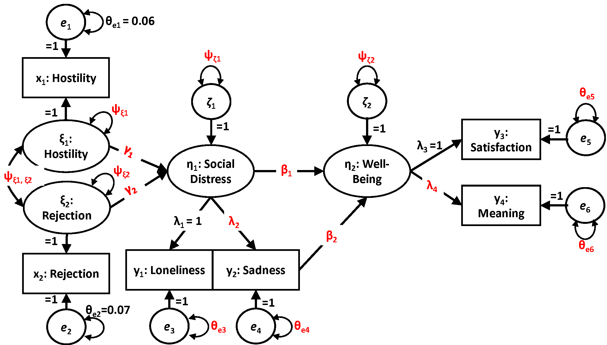
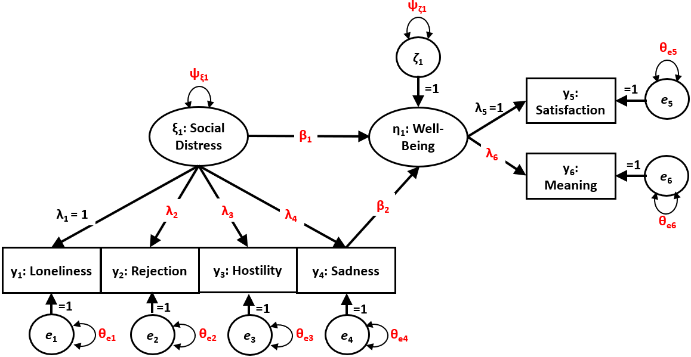

```{r setup, include=FALSE, message=FALSE, warning=FALSE, note=FALSE}
knitr::opts_chunk$set(echo = FALSE, message=FALSE, warning=FALSE, note=FALSE, cache=TRUE)
require(tidyverse)
require(flexplavaan)
require(lavaan)
```

# Introduction
It is currently an unprecedented time in the social sciences; multiple scientific disciplines are reeling from a "replication crisis" [@Camerer2018; @Ioannidis2005; @Pashler2012a], new norms for credibility are becoming more prevalent (Nelson, Simmons, & Simonsohn, 2018; Nosek, Ebersole, DeHaven, & Mellor, 2018), and the push for open science is accelerating at a rapid pace [@Nosek2018]. Amidst this push for open science practices, some have called for greater use of visualization techniques [@Fife2019a; @Fife2019e; @Tay2016a]. As noted by Tay, et al. (2016), "[visualizations]...can strengthen the quality of research by further increasing the transparency of data..." (p. 694). In other words, one of the best, and most efficient ways of making data analysis open and transparent is to display each and every data point through visualization techniques. This is particularly important in research applications where participant-level data cannot be shared.

Not only do visualizations adhere to the principles of openness and transparency, but they offer several additional advantages; they vastly improve encoding of information [@Correll2015], they highlight model misfit [@Healy2014a], and they are an essential component in evaluating model assumptions [@Levine2018; @Tay2016a]. As such, we [as well as others, e.g., @Fife2019b; @Fife2019e; @Wilkinson1999a] recommend every statistical model ought to be accompanied by a graphic. 

Unfortunately, this suggestion is easier said than done. While visualizing some statistical models is trivial (e.g., regressions, $t$-tests, ANOVAs, multiple regression), visualizing others is not. One particularly troublesome class of models to visualize is latent variable models (LVMs). While researchers routinely visualize LVMs with conceptual models (e.g., via path diagrams), visualizing statistical models is not so easy. The former visualizations are common, while the latter are not [@Hallgren2019a]. The reason statistical visualizations of LVM are not intuitive is because they rely on unobserved variables [@bollen_structural_1989]. If the variables of interest are unobserved, how can we possibly visualize them? 

Though it is not, at first glance, intuitive how to visualize unobserved variables, that does not mean visualizing them is any less important. On the contrary, visualizing latent variables is more important because their presence is unobserved. In the following section, we elaborate on how LVMs are traditionally evaluated and why visualizations are particularly crucial. We then review previous approaches others have used for visualizing LVMs, and note their strengths and weaknesses. We then introduce our approach and the corresponding R package `flexplavaan`, which allows users to visualize both `lavaan` and `blavaan` objects in R. We then conclude with several examples that highlight how visualizations assisted in identifying appropriate statistical models. 

# Evaluating Model Fit in LVMs

The validity of LVM-based inferences assume structural models closely approximate real-world causal processes [@bollen2019model; @Hayduk2014]. Unfortunately, evaluating model adequacy in LVMs is rife with obstacles. For one, misspecifications in any one part of the model can lead to biases that spread throughout the full systems of equations [@bollen2019model]. To combat this, LVM practitioners generally rely on global fit tests and approximate fit indices to evaluate the model adequacy [@jackson2009reporting]. 

Yet global fit indices themselves represent an obstacle to intelligent model evaluation. Models can yield desirable values (e.g., a non-significant $\chi^2$ test), even when specific aspects of the model are substantially misspecified [@Goodboy2017; @Hayduk2014; @tomarken2003potential]. In other words, a nonsensical model can still yield estimates that lead one to believe in their own statistical models. Moreover, in our experience, applied users often lack an intuitive understanding of what global fit statistics tell them about their models. Does a TLI of 0.95 mean we have established a strong theoretical foundation for a model? If RMSEA dips below 0.05, should we consider our model statistically/clinically significant? 

While global fit measures may be useful in comparing models and/or identifying problematic model features, users instead rely on conventional cutoffs [e.g, @hu1998fit] to determine whether a model is "adequate," a practice that has received resounding criticism [@barrett2007structural; @Chen2008; @hayduk2014shame; @McIntosh2007]. {I think this last line should go with the previous paragraph. I'm not sure it fits here.}This lack of understanding is evident when applied users express confusion about why global fit indices sometimes provide seemingly conflicting assessments of model fit [@lai2016problem]. 

A number of scholars have emphasized the importance of supplementing LVM global fit indices with local fit assessment, investigating the tenability of all specific model implications individually [@bollen2019model; @Goodboy2017; @Hayduk2014; @Thoemmes2018; @tomarken2003potential; @Tomarken2005]. Local fit evaluation procedures (e.g., inspection of residual correlation matrices [@bollen_structural_1989], confirmatory tetrad analysis [@hipp2003model], and equation-based overidentification tests [@bollen2019model]) can help identify individual model specifications that are inconsistent with the data and may give clues about effective remedial strategies [@bollen_structural_1989; @Goodboy2017; @tomarken2003potential; @Tomarken2005]. 

While local fit indices are an important part of model evaluation @Kline2004, they too have limitations. First, although local fit evaluation can be helpful in identifying which implied bivariate associations are most discrepant with the data, they do not necessarily pinpoint the source of the problems [@hayduk2018review]. For instance, an error in the specification of the measurement of an exogenous latent variable could lead to a large residual correlation between measured indicators for the exogenous and endogenous latent variables even if the structural portion of the model is properly specified. Notably, the model-implied instrumental variable (MIIV) approach can contain problems caused by misfit in one aspect of a model and prevent ill effects from spreading [@bollen2019model]. Second, it is unclear when a non-zero residual correlation should be interpreted as meaningful. Imposing a cutoff value is one approach @Goodboy2017, though the magnitude of discrepancies is an imperfect metric for determining its practical import [@Hayduk2014]. Standardized residual correlations allow for significance tests for each element of the residual correlation matrix, though residual correlation matrices often include many elements, requiring an adjustment to the p-value to avoid an inflated Type I error rate [@bollen1991observational]. Finally, residual correlations may not alert modelers to strong nonlinear associations among observed variables [@flora2012old]. 

Another problem shared by both global and local fit indices is that they are a highly *compressed* representations of both the data and the model. Many readers may be familiar with Anscombe's quartet (reproduced in Figure \@ref(fig:anscombe)). There is a many-to-one relationship between data and indices; very different types of data may yield identical statistics (in this case, correlations, slopes and intercepts). Some of these data patterns may be very poorly represented by the model. This problem is only exacerbated with LVMs simply because traditional algorithms compress the data at multiple levels (e.g., raw data are compressed into means/covariances, which are then compressed into model parameter estimates and/or indices that evaluate model fit). Put differently (and perhaps quite cynically), LVM is the process of compressing hundreds or thousands of datapoints into a handful (or less) of estimates that may or may not represent the data-generating process. When considered from this perspective, the most common practices of evaluating model fit seem primitive, at best. 

```{r anscombe, fig.cap="A reproduction of Anscombe's quartet. Each plot has identical regression lines/correlations, even though the underlying data are vastly different.", fig.width=6, fig.height=3}
require(tidyverse)
require(flexplavaan)
xs = anscombe %>% 
  pivot_longer(x1:x4, names_to="group", values_to="x", names_pattern="x(.*)") %>% 
  select(group, x)
ys = anscombe %>% 
  pivot_longer(y1:y4, names_to="group", values_to="y", names_pattern="y(.*)") %>% 
  select(y)

d = cbind(xs, ys)
ggplot(d, aes(x=x, y=y)) +
  geom_point() +
  geom_smooth(method="lm", se=FALSE, fullrange=T) +
  facet_grid(~group, ) +
  theme_bw() + 
  theme(
    strip.background = element_blank(),
    strip.text.x = element_blank()
  )
```


The best defense against this compression is to rely on modeling evaluation strategies that evaluate *un*compressed data. Perhaps the best (if not only) way to evaluate uncompressed data is through visualizations, particularly visuals that display raw data [@Fife2019e]. 

# Previous Approaches to Visualizing LVMs
There is sparse literature describing visual strategies for evaluating the adequacy of LVMs, at least when compared to the extensive literature discussing the merits of global fit tests and indices [e.g., @barrett2007structural; @Chen2008; @hayduk2014shame; @hu1998fit; @McIntosh2007; @shi2020effect; @smith2001primer; @Steiger2007]. Additionally, while reporting of numeric fit indices is ubiquitous in LVM applications [@jackson2009reporting], plots of data underlying LVMs are rare [@Hallgren2019a]. There are, however, some strategies for using visuals to evaluate the tenability of model assumptions, diagnose causal misspecifications, and select the best model from a group of competitors.  

A common visual approach for identifying model-data discrepancies is to plot the distribution of the residuals of the covariances/correlation matrix [e.g., using stem-and-leaf plots or histograms; @bollen_structural_1989]. This can aid in identifying specific components of the data that the model struggles to capture [@bollen_structural_1989; @bollen1991observational], which might not be detected with global fit indices [@Goodboy2017; @tomarken2003potential; @Tomarken2005]. 

Unfortunately, these plots suffer from two major problems. First, the residuals in this case are themselves *compressed* estimates. As such, we might have a model that is poorly represented by linear correlations (e.g., if the data contain nonlinear relationships), but that problem would never be uncovered by studying residual plots. 

A second problem with plots of correlation/covariance residuals is they are extremely limited in the amounts of misspecification they might reveal. For example, suppose we model a latent variable with three indicators ($X_1$, $X_2$, and $X_3$), but the data-generating model actually has $X_3$ associated with $X_2/X_1$, but not an indicator of the latent variable (see Figure \@ref(fig:implied)).[^equiv] These two models will have the same implied variance/covariance matrix.[^covmat] In other words, a stem and leaf plot will not signal any problems, despite problems existing. 

[^equiv]: This problem is similar, but not identical to equivalent models [@Lee90; @MacCallum93]. When two models are equivalent, they have identical variance/covariance matrices *and* identical degrees of freedom (DF). In this case, the two models do not have identical DF. However, the visuals we present do offer an intuitive approach for evaluating equivalent models. Two equivalent models with different latent models will have different visuals. Additionally, these visual will allow one to detect problems with equivalent models, which cannot be detected with traditional model-evaluation statistics. 


[^covmat]: In the left model, the standardized relationship between $X_1/X_3$ is $a_1\times c_1$, while in the right model it is $r_2$. Likewise, the $X_1/X_2$ relationship is $a_1\times b_1$ in the left model, while it is $r_1$ in the right model. The LVM machinery will attempt to make $a_1\times c_1 = r(X_1, X_3)$, which is the same as setting $a_1\times c_1 = r_2$ (and it will set $a_1\times b_1$ to $r_1$). 


\begin{figure}
\begin{center}
\begin{tikzpicture}[node distance=2cm, auto,>=latex, thick, scale = 0.5]
\node[draw, circle] (f) {$F$};
\node[draw, rectangle] (x2) [below of=f] {$X_2$};
\node[draw, rectangle] (x3) [right of=x2, node distance = 1cm] {$X_3$};
\node[draw, rectangle] (x1) [left of=x2, node distance = 1cm] {$X_1$};
\draw[->, left] (f) to node {$a_1$} (x1);
\draw[->] (f) to node {$b_1$} (x2);
\draw[->, right] (f) to node {$c_1$} (x3);

\node[draw, circle] (f2) [right of=f, node distance = 3cm] {$F$};
\node[draw, rectangle] (x22) [below of=f2] {$X_2$};
\node[draw, rectangle] (x32) [right of=x22, node distance = 1cm] {$X_3$};
\node[draw, rectangle] (x12) [left of=x22, node distance = 1cm] {$X_1$};
\draw[->, left] (f2) to node {$a_2$} (x12);
\draw[->, right] (f2) to node {$b_2$} (x22);
\draw[<->] (x22) edge[out=270, in=270,<->, below] node {$r_1$} (x32)  ;
\draw[<->] (x12) edge[out=270, in=270,<->, below] node {$r_2$} (x32.south east)  ;
\end{tikzpicture}
\caption{The model on the left is the user-specified model, while the model on the right is the data-generating model. These two models make very different theoretical statements, but have the same implied correlation between the variables.}
\label{fig:implied}
\end{center}
\end{figure}


Rather than visualizing aggregates in LVMs, the raw data themselves ought to be visualized. @bollen1991observational developed methods for calculating raw and standardized individual case residuals (ICRs), which represent the difference between observed and model-estimated case values for outcome variables [@bollen1991observational]. These ICRs are then plotted to help locate outlying and influential observations. @pek2011sensitivity demonstrated how diagnostic procedures commonly used in generalized linear models (e.g., Mahalanobis distance, generalized Cook’s D, and DFBETAs) can be applied to LVMs to detect influential cases with index plots. @flora2012old applied these diagnostic procedures and others specifically to factor analysis models, and @yuan2010fitting used visualizations of Mahalanobis distance metrics to identify high-leverage cases and outliers. Open-source R packages, including `faoutlier` [@chalmers2017package] and `influence.SEM` [@pastore2018package], have used these visualization procedures to show case influence on model fit (e.g., likelihood differences) and parameter estimations (e.g., generalized Cook’s D). @lee2015parameter also demonstrated how visualization can be used to identify specific parameters estimates with strong influence on global model fit. 

@Asparouhov2017 proposed a method for extending the diagnosticity of ICRs to detect specific structural misspecifications. They demonstrated that plots of estimated factor scores against observed predictor variables can be used to detect unspecified nonlinear effects of the predictor on the latent outcome. Furthermore, they used ICR scatterplots to detect violations of local independence in a congeneric latent factor model. Finally, they demonstrated in a latent factor model how plotting predicted values for a reflective indicator against the observed indicator values could aid in uncovering unmodeled heterogeneity that could be better captured using a mixture model. 

@raykov2014latent used visualizations of ICRs to aid in model selection in the context of latent growth curve modeling. When comparing linear and quadratic growth curve models for the same data, for example, they showed that a scatterplot of the ICRs for the quadratic model vs. ICRs for a linear model can help identify which model best minimizes model-data discrepancies. In the context of growth mixture modeling, @wang2005residual showed how visualization of empirical Bayes residuals (e.g., Q-Q and trajectory plots) can aid in determining the appropriate number of classes, an adequate shape of within-class growth trajectories, and missing confounders.  

In short, ICRs have been used to identify high influence/leverage datapoints, nonlinear effects, heterogeneity, and to compare models. While these are certainly a step in the right direction, existing approaches suffer from a few weaknesses. First, ICRs rely on factor score estimates. Individual latent factor scores cannot be uniquely determined [@grice2001computing; @rigdon2019factor; @steiger1996dispelling]. In cases where factors are highly indeterminate -- e.g., factors with few indicators only weakly predicted by the latent factor -- different factor score estimation methods can yield highly discrepant values, potentially even estimates that are negatively correlated [@grice2001computing]. Also, ICRs are computed under the assumption the model is correct. When the model is misspecified, it is unclear how these visual diagnostics will behave. It is possible, of course, that for misspecified models, ICRs will reveal that misfit. (In fact, we show later that, at least under some circumstances, this is indeed the case). A final limitation of existing approaches is that many of their visuals cross platforms; some tools were developed in R (e.g., `influence.SEM` and `faoutlier`), some in Mplus [e.g., @Asparouhov2017], and some approaches provided no software implementation (e.g., xxxxx). {I think just about all of the articles we reviewed that had visualization strategies provided code or a program for obtaining the plots.}

In this paper, we introduce `flexplavaan`, a suite of visualization tools designed to visualize `lavaan` models in R. Before we introduce `flexplavaan` and its core functions, however, we explain the types of graphics used and the rationale behind them. 

# Our Approach (Linear LVMs)

## Example Data
{As a Star Wars fan, I simply love this example. It is fun! However, if we are submitting to Psych Methods, I wonder if it makes sense to change the variables so that the model deals with ubiquitous psychological constructs. That makes the example boring, bu at the same time, I can see a non-Star Wars fan reviewer not appreciating this example.}
To motivate our discussion/explanation of visualizing LVMs, we begin with a simulated dataset. Suppose the Jedi Council is attempting to identify Padawans who will make good Jedi Knights. To do so, they develop seven indicators (light saber score, fitness score, midichlorian levels, and a Jedi history exam, as well as three written exams completed at the end of Jedi training). Unbeknownst to the Jedi, these indicators measure two latent factors (force and Jedi), according to the relationships specified in Figure \@ref(fig:force). Notice that one variable (history) has cross loadings on both factors. Also notice the path from force to Jedi is represented by a curved *one*-headed arrow. This is to indicate there is a curvilinear relationship between the two variables. 


<br>

\begin{figure}
\begin{center}
\begin{tikzpicture}[node distance=2cm, midway, scale=1.5, every node/.style={scale=1.5}]

\node[draw, circle] (force) {Force};
\node[draw, circle, node distance = 2cm] (jedi) [right of=force] {Jedi};

\node[draw, rectangle] (saber) [left of=force] {Saber};
\node[draw, rectangle, node distance = 1cm] (fit) [above of=saber] {Fitness};
\node[draw, rectangle, node distance = 1cm] (midi) [below of=saber] {Midichlorian};

\node[draw, rectangle] (hist) [below of=jedi] {History};

\node[draw, rectangle] (e2) [right of=jedi] {Exam II};
\node[draw, rectangle, node distance = 1cm] (e1) [above of=e2] {Exam I};
\node[draw, rectangle, node distance = 1cm] (e3) [below of=e2] {Exam III};

\draw[->] (force) to node [fill=white]{\scriptsize $b$} (saber);
\draw[->] (force) to node [fill=white]{\scriptsize $a$} (fit);
\draw[->] (force) to node [fill=white]{\scriptsize $c$} (midi);

\draw[->] (jedi) to node [fill=white]{\scriptsize $d$} (e1);
\draw[->] (jedi) to node [fill=white]{\scriptsize $e$} (e2);
\draw[->] (jedi) to node [fill=white]{\scriptsize $f$} (e3);

\draw[->] (jedi) to node [fill=white]{\scriptsize $g_1$} (hist);
\draw[->] (force) to node [fill=white]{\scriptsize $g_2$} (hist);

\draw[->] (force) edge[out=25, in=180,->, below] node {\scriptsize $\beta$} (jedi);
\end{tikzpicture}
\caption{Simulated dataset of Jedi selection and training. This model features a crossloadings on the 'history' indicator, as well as a nonlinear relationship between force and Jedi. This is the data-generating model.}
\label{fig:force}
\end{center}
\end{figure}

```{r}

fit = fitMeasures(force_fit$lavaan) %>% round(digits=4)
significance = ifelse(fit[["pvalue"]]>0.05, " is not statistically significant", " is statistically significant")
```

Unfortunately, the Jedi Council posits the model shown in Figure \@ref(fig:councilModel). (Jedi are notoriously poor at psychometrics.) While most of the important elements are there, the Jedi's (incorrect) model specifies that history loads only onto force, and they posit a linear (rather than nonlinear) path from force to Jedi. According to traditional measures of fit, the $\chi^2$ `r significance`. Also, the CFI (`r fit[["cfi"]]`), TLI (`r fit[["tli"]]`), RMSEA (`r fit[["rmsea"]]`), and SRMR (`r fit[["srmr"]]`) indicate respectable fit. In the examples that follow, we will use this example both to demonstrate how the visualization algorithms function and how they are able to identify misspecification that traditional fit statistics fail to capture. 

\begin{figure}
\begin{center}
\begin{tikzpicture}[node distance=2cm, midway, scale=1.5, every node/.style={scale=1.5}]

\node[draw, circle] (force) {Force};
\node[draw, circle, node distance = 2cm] (jedi) [right of=force] {Jedi};

\node[draw, rectangle] (saber) [left of=force] {Saber};
\node[draw, rectangle, node distance = 1cm] (fit) [above of=saber] {Fitness};
\node[draw, rectangle, node distance = 1cm] (midi) [below of=saber] {Midichlorian};

\node[draw, rectangle] (hist) [below of=jedi] {History};

\node[draw, rectangle] (e2) [right of=jedi] {Exam II};
\node[draw, rectangle, node distance = 1cm] (e1) [above of=e2] {Exam I};
\node[draw, rectangle, node distance = 1cm] (e3) [below of=e2] {Exam III};

\draw[->] (force) to node [fill=white]{\scriptsize $b$} (saber);
\draw[->] (force) to node [fill=white]{\scriptsize $a$} (fit);
\draw[->] (force) to node [fill=white]{\scriptsize $c$} (midi);

\draw[->] (jedi) to node [fill=white]{\scriptsize $d$} (e1);
\draw[->] (jedi) to node [fill=white]{\scriptsize $e$} (e2);
\draw[->] (jedi) to node [fill=white]{\scriptsize $f$} (e3);

\draw[->] (force) to node [fill=white]{\scriptsize $g_2$} (hist);
\draw[dotted, ->] (jedi) to node [fill=white]{\scriptsize $g_1$} (hist);

\draw[->, line width = .7mm] (force) to node [above]{\scriptsize $\beta$} (jedi);
\end{tikzpicture}
\caption{Actual model fitted to the Jedi dataset. This posits a linear (rather than nonlinear) relationship between the latent variables Jedi and force and fails to model the Jedi to history relationship.}
\label{fig:councilModel}
\end{center}
\end{figure}

## Hopper Plots

Traditionally, conscientious researchers wanting to engage in model evaluation will often produce stem-and-leaf diagrams of the residual variance/covariance matrix. However, stem-and-leaf diagrams are somewhat less intuitive, especially for those without experience interpreting them. As an alternative, we suggest using what we call "hopper plots," which plot the size of the residuals against the rank-ordered correlations (see Figure \@ref(fig:hopper)). The dots represent the residual size, while the lines show the absolute value of the residual (on the right) and $-1\times$ the absolute value of the residual (on the left). These plots end up looking like a funnel, but the name "funnel plot" was already snagged by meta-analytic researchers [@egger1997bias]. Instead, we call them hopper plots. (A hopper is a type of funnel, frequently used to dispense grains.) By default, hopper plots only show those variables with residuals larger than 0.01 (in absolute value). 

```{r hopper, fig.cap='An example of a "hopper plot," which graphs the discrepancy between the implied and observed correlation matrix. The dots represent observed residuals, while the lines represent the absolute value/negative absolute value.'}
require(ggplot2)
residual_plots(force_fit) + theme(text=element_text(size=14))
```


## Trace Plots

In order to conceptualize our approach to visualizing LVMs, let us first consider how typical linear models are visualized. In a standard regression, each dot in a scatterplot represents scores on the observed variables. Often, analysts overlay additional symbols to represent the fit of the model (e.g., a line to represent the fitted regression model, or large dots to represent the mean). Sometimes additional symbols are overlaid to represent uncertainty (e.g., confidence bands for a regression line or standard error bars). In either case, the dots represent observed information, while the fitted information is conveyed using other symbols. 

Likewise, visualizing LVMs might follow similar conventions; the dots should represent the observed information, as in @Bauer2005. In his visuals, pairwise relationships between observed variables are represented in a scatterplot. However, Bauer’s approach did not overlay a model-implied fit, as we seek to do. When the line represents the model-implied fit, it denotes the "trace" left behind by the unobserved latent variable. As such, we call these plots "trace plots."

How then does one identify the slope/intercept of the LVM’s model-implied fit? It is quite easy to do so when standard linear LVMs are used. Recall how our force factor has four indicators (e.g., saber, fitness, midichlorians, and history). To visualize the bivariate relationship between saber and fitness, for example, we can simply utilize the model-implied variance/covariance matrix. Recall the relationship between a covariance and a slope:

$$\beta_{y|x} = \frac{\sigma^2(x,y)}{\sigma^2_x}$$

For our example, 

$$b_{\text{S}|\text{F}} = \frac{\hat{\sigma}^2_{\text{S},\text{F}}}{\hat{\sigma}^2_F}$$   

\noindent where $S$ and $F$ represent "saber" and "fitness," respectively, and ${\hat{\sigma}^2_F}$ represents the *residual* variance of fitness. (Put differently, this is the expected slope between saber and fitness, unadjusted for unreliability). With the slope, one can then estimate the intercept using basic algebra:

$$b_0=\overline{S}-\beta_{\text{S}|\text{F}}\times \overline{\text{F}}$$

Figure \@ref(fig:trace1) shows the LVM model-implied fit in red with a regression line in blue. Because the regression line minimizes the sum of squared errors, we would hope the LVM fitted line (red) closely approximates the regression line (blue). In this case, the two are similar, but there is a visually detectable difference between the two; the model (red line) underestimates the relationship between the two variables. 

```{r trace1, fig.cap = "The LVM-implied fit between fitness score and light saber score, shown in red. The blue line represents the regression line between the two variables. The more closely the model-implied fit line resembles the regresson line, the better the fit of the LVM."}
  # compute the model-implied slope
viz_diagnostics(jedi_jedi, aes(y=fitness, x=saber), fit.lavaan = force_fit$lavaan, plot="trace", method="lm")+
  labs(y="Fitness Score", x="Light Saber Score") +
  theme_bw()+ theme(text=element_text(size=14))
```


Of course, Figure \@ref(fig:trace1) only shows one pairwise relationship between variables. If we wished to visualize all the variables in our model, we would have to utilize a scatterplot matrix, as in Figure \@ref(fig:traceMatrix). The diagonal elements show histograms of ICRs, enabling researchers to (somewhat) evaluate the assumption of normality.[^mvnorm]  Naturally, this becomes quite cumbersome when users have more than seven or eight variables. In this case, it is best to visualize only a subset of variables. By default, `flexplavaan` sorts the scatterplot matrix using a blockmodeling algorithm, then presents the block with the largest residuals first. For our figure (Figure \@ref(fig:traceMatrix)), we have examined only the variables associated with the latent force variable, while Figure \@ref(fig:traceMatrix2) shows the variables associated with the latent Jedi variable. We have also asked `flexplavaan` to show a loess line instead of a regression line, which will allow us to detect nonlinear patterns. These figures reveals some potential problems, including some nonlinearity, some underestimation (e.g., between saber and midichlorian), and some overestimation (e.g., between saber and history). 

[^mvnorm]: Technically, maximum likelihood-based LVMs assume multivariate normality, while these plots show univariate normality. However, the univariate plots at least suggest when multivariate normality might be violated. 

```{r traceMatrix, fig.cap="Scatterplot matrix showing the model-implied fit (red) and loess lines (blue) between four simulated indicator variables. These four variables are the indicators for the force latent variable. The diagonals show the histograms of the ICRs."}
require(flexplavaan)
flexplavaan::visualize(force_fit, plot="model", subset=c("saber", "fitness", "midichlorian", "force_history"), sort_plots = FALSE)
```


The primary advantage of trace plots is that they easily show many types of misspecification in LVMs. Another advantage is they visually (and often times strikingly) show how little information a model might capture. Returning to Figure \@ref(fig:traceMatrix), we see that many of the bivariate plots reveal quite weak relationships; many of the slopes are quite near zero. Recall that global fit indices suggested a well-fitting model. The trace plots, however, suggest there's little information to fit from the beginning for at least some of these relationships.  

```{r traceMatrix2, fig.cap="Scatterplot matrix showing the model-implied fit (red) and regression-implied fit (blue) between four simulated indicator variables. These four variables are the indicators for the Jedi latent variable. The diagonals show the histograms."}
require(flexplavaan)
flexplavaan::visualize(force_fit, plot="model", subset=c("exam_one", "exam_two", "exam_three", "force_history"), sort_plots = FALSE)+ theme(text=element_text(size=14))
```

# Disturbance-Dependence Plots
	
One common technique for visualizing the adequacy of statistical models in classic regression is residual-dependence plots. With these graphics, one simply plots the residuals of the model ($Y$ axis) against the predicted values ($X$ axis). The rationale behind this is simple: the model should have extracted any association between the prediction and the outcome. The residuals represent the remaining information after extracting the signal from the model. If there is a clear trend remaining in the data (e.g., a nonlinear pattern or a "megaphone" shape in the residuals), this indicates the model failed to capture important information.
	
Likewise, in LVMs, we can apply this same idea to determine whether the fit implied by the LVM has successfully extracted any association between any pair of predictors. However, in LVMs, residuals refer to the discrepancy between the model-implied and the actual variance/covariance matrix (or correlation matrix). As such, naming these plots "residual-dependence plots" would be a misnomer. Rather, misfit at the raw data level is typically called either a disturbance {I think disturbance is used interchangebly with error, not residual} or an individual case residual (ICR), as mentioned previously. In this paper, we call these plots disturbance-dependence plots. 

Like trace plots, we visualize disturbance-dependence plots for each pair of observed variables. To do so, `flexplavaan` subtracts the fit implied by the model from the observed scores. For example, a disturbance dependence plot for an $X_1/X_2$ relationship would subtract the "fit" of $X_2$ implied by the model from the actual $X_2$ scores (and vice versa for the $X_2/X_1$ relationship). {Does getting individuals fitted values implied by the model depend on factor score estimates?} If the trace-plot fit actually extracts all association between the pair of observed variables, we would expect to see a scatterplot that shows no remaining association between the two. If there is a pattern in the scatterplot remaining, we know the fit of the model misses information about that specific relationship. 

To aid in interpreting these plots, we can overlay the plot with a flat line (with a slope of zero), as well as a regression (or loess) line. The first line indicates what signal should remain after fitting the model, while the second line shows what actually remains. 

Figure \@ref(fig:ddp) shows an example of trace plots in the upper triangle and disturbance-dependence plots in the lower triangle of a scatterplot matrix. These plots are for the same data shown in the right image of Figure \@ref(fig:traceMatrix2). Notice how many of the plots have nonlinear patterns showing up in both the DDP and the trace plots. 

(ref:crossloadcitation) This plot shows a disturbance-dependence plot for the same data visualized in Figure \@ref(fig:traceMatrix2) in the lower triangle.

```{r ddp, fig.cap='(ref:crossloadcitation)'}
flexplavaan::visualize(force_fit, subset=c("exam_one", "exam_two", "exam_three", "force_history"), sort_plots = FALSE)+ theme(text=element_text(size=14))
```

Together, both of these plots (trace plots and DDPs) serve as a critical diagnostic check. Both these plots will signal certain types of misfit both in the measurement and structural components of the model. However, these plots suffer from a major weakness. Recall how earlier we referenced Figure \@ref(fig:implied) and noted that sometimes severe misspecification will go undetected simply because an incorrect model will often yield a model-implied covariance matrix that well approximates the actual covariance matrix. However, this sort of misspecification may show up in measurement plots, which we address next. 

# Measurement Plots

Earlier we mentioned how @Asparouhov2017 utilized factor score estimates to visualize ICRs as a diagnostic tool. One of their plots showed the latent variable on the $Y$ axis and the observed (indicator) variable on the $X$ axis. While these may be capable of revealing nonlinearities, they cannot reveal other sorts of misspecification (e.g., many types of cross-loadings and residual correlations) without a simple modification. The modification we propose is similar to the traceplots: overlay the model-implied slope and a regression (or loess) line. 

Fortunately, similar to the trace plots, we can use the model-implied variance/covariance matrix of the observed/latent variables to determine the model-implied slope. The advantage of these plots is they are far more sensitive to many types of misspecification than trace plots. This is because trace plots are unable to pick up misspecification unless that misspecification introduces bias in estimating the observed variance/correlation matrix. However, as shown in Figure \@ref(fig:implied), not all misspecification manifests itself as bias in estimating correlations between observed variables. While the two models in Figure \@ref(fig:implied) will not yield different observed covariances, they will yield different latent variable estimates (and thus, different covariances between latent/observed). 

Figure \@ref(fig:measurementplot) plots several graphs of the relationship between the observed variables and the latent variables. To do so, `flexplavaan` puts all variables on a common scale. Additionally, `flexplavaan` defaults to displaying only four observed variables at a time. Which four are chosen is determined by the degree of discrepancy between the observed (blue) and model-implied (red) slope, such that the four observed variables with the largest discrepancy are chosen. From Figure \@ref(fig:measurementplot), we see that the model consistently underestimates the relationship between the indicators and the latent variables, and that this underestimation is stronger for the Jedi latent variable. It is also interesting to note that the history indicator is nearly synonymous with the force latent variable. 

```{r measurementplot, fig.cap='This image, called a measurement plot, shows the relationship between the latent variables ($Y$ axis) and each standardized indicator. The blue lines are loess lines, while the red lines are the model-implied fits of the model.'}
a = implied_measurement(force_fit, latent="Force", method="loess", alpha=.2)[[1]]
b = implied_measurement(force_fit, latent="Jedi", method="loess", alpha=.2)[[1]]
cowplot::plot_grid(a, b)
```


# Structural (Cross-Hair) Plots
<!-- One of the primary purposes of the diagnostics is to determine whether one's conceptualization of the latent variables is to be believed. If the trace plots and disturbance dependence plots indicate the LVM is a good representation of the data, one can be more confident the latent variables are properly estimated. If this is the case, we can now make a step toward visualizing the latent variables themselves.  -->
<!-- Another alteration from a standard scatterplot is the use of vertical bars to indicate uncertainty in estimating the latent variables. In Figure \@ref(measurementplot), the dots represent the estimated factor scores and the lines indicate $\pm 1 SD$. The red line is a "ghost line" [@Fife2019c], which simply repeats the line from the second panel ($x2$) to the other panels. This makes it easier to identify which indicators best load onto the latent variable (i.e., which indicator is most reliable). In Figure \@ref(fig:measurementplot), $x2$ has the largest factor score.  -->

When modeling latent variables, often the visuals of interest are not the observed variables, but the latent variables. In other words, the measurement model is ancillary to the substantive model. Naturally, we might wish to visualize the relationship between the latent variables.

However, our latent variables are merely estimates. As such, we ought to have visuals that reflect uncertainty in our estimates of the latent scores. In `flexplavaan`, this uncertainty is represented as crosshairs. The widths of each line of the crosshair (for both the $X$ axis and the $Y$ axis) are obtained from prediction intervals for `lavaan` objects (using the `plausibleValues` function of the `semTools` package). Figure \@ref(fig:beech) shows these plots, which we call "structural plots," or "cross-hair plots". Interestingly, the relationship between the two, though simulated to be significantly nonlinear, shows up as fairly linear. This seems to suggest that, by the time a model's factor scores are estimated, any nonlinearity that exists in the data has been discarded. For this reason, we disagree with the approach recommended by @Hallgren2019a, who suggest researchers plot a structural plot as evidence for model fit; simply plotting structural plots without the previous graphics will yield a very misleading picture of data/model fit. This final plot is little more than a summary of the model, provided the model diagnostics check out. Showing these is no more meaningful than reporting a p-value for a model that may or may not meet statistical assumptions. 

```{r beech, fig.cap='Structural or "cross-hair" plot of the relationship between the latent variables force and Jedi. The crosshairs represent the prediction intervals for the factor scores of the latent variables.', echo=FALSE}
flexplavaan::visualize(force_fit, plot="latent", method="loess")[[1]]

```

When there are multiple latent variables, there is a great deal of flexibility in how one visualizes the structural model. `flexplavaan` makes a best guess at how to visualize this relationship using the model specified by the user. However, the user can always specify how to plot the structural model using a `flexplot` equation [@Fife2019c]. In our example, we only had two variables to visualize, so a simple bivariate plot was most natural. When more variables are included, we might utilize paneling, added variable plots, beeswarm plots, etc. For a review of the types of plots possible, see @Fife2019c. 

# Model Comparisons

It is quite common to compare two different models when using LVMs. Indeed, model comparisons are a recommended strategy for building LVMs [@rodgers_epistemology_2010]. Not only can we use statistics to do model comparisons, but we can also compare them visually. All plots previously mentioned (hopper plots, trace plots, DDPs, and structural plots) can visualize two models at the same time. While visualizing two models side-by-side makes differences more visually detectable, we also recommend visualizing each model individually since certain aspects of misfit in a model might be masked by the comparison. 

For illustration purposes, we're going to fit a second model that attempts to address both the nonlinearity and the missing cross-loading. The second model is shown in Figure \@ref(fig:forceNonlin). To model the nonlinearity, we have created three nonlinear indicators (saber$^2$, fitness$^2$, and midichlorian$^2$), as well as added the cross-loading from Jedi to history. 

\begin{figure}
\begin{center}
\begin{tikzpicture}[node distance=2cm, midway, scale=1.5, every node/.style={scale=1.5}]

\node[draw, circle] (force) {Force};
\node[draw, circle, node distance = 2cm] (forcesq) [above right of=force] {$\text{Force}^2$};
\node[draw, circle, node distance = 2cm] (jedi) [right of=force] {Jedi};

\node[draw, rectangle] (saber) [left of=force] {Saber};
\node[draw, rectangle, node distance = 1cm] (fit) [above of=saber] {Fitness};
\node[draw, rectangle, node distance = 1cm] (midi) [below of=saber] {Midichlorian};


\node[draw, rectangle] (sabersq) [above of=forcesq] {$\text{Saber}^2$};
\node[draw, rectangle, node distance = 1.6cm] (fitsq) [left of=sabersq] {$\text{Fitness}^2$};
\node[draw, rectangle, node distance = 2.1cm] (midisq) [right of=sabersq] {$\text{Midichlorian}^2`$};


\node[draw, rectangle] (hist) [below of=jedi] {History};

\node[draw, rectangle] (e2) [right of=jedi] {Exam II};
\node[draw, rectangle, node distance = 1cm] (e1) [above of=e2] {Exam I};
\node[draw, rectangle, node distance = 1cm] (e3) [below of=e2] {Exam III};

\draw[->] (force) to node [fill=white]{\scriptsize $b$} (saber);
\draw[->] (force) to node [fill=white]{\scriptsize $a$} (fit);
\draw[->] (force) to node [fill=white]{\scriptsize $c$} (midi);

\draw[->] (forcesq) to node [fill=white]{\scriptsize $b_2$} (sabersq);
\draw[->] (forcesq) to node [fill=white]{\scriptsize $a_2$} (fitsq);
\draw[->] (forcesq) to node [fill=white]{\scriptsize $c_2$} (midisq);

\draw[->] (jedi) to node [fill=white]{\scriptsize $d$} (e1);
\draw[->] (jedi) to node [fill=white]{\scriptsize $e$} (e2);
\draw[->] (jedi) to node [fill=white]{\scriptsize $f$} (e3);

\draw[->] (force) to node [fill=white]{\scriptsize $g_2$} (hist);
\draw[->] (jedi) to node [fill=white]{\scriptsize $g_1$} (hist);

\draw[->, line width = .7mm] (force) to node [below]{\scriptsize $\beta$} (jedi);

\draw[<->] (force.north) edge[out=90, in=180, above] node {$r_1$} (forcesq.west)  ;
\draw[->] (forcesq.south east) to node [above right]{$r_2$} (jedi.north)  ;


\end{tikzpicture}
\caption{Nonlinear model for the Jedi dataset. This model proposes a new latent variable ($\text{Force}^2$) that has saber, fitness, and midichlorian as squared indicators. This model also allows history to load onto both force and Jedi.}
\label{fig:forceNonlin}
\end{center}
\end{figure}

Figure \@ref(fig:hopperModcomp) shows the residual plots, for all pairwise relationships. The new model seems to have reduced the largest residuals (though it has, in some instances, slightly increased the size of some residuals). 

```{r hopperModcomp, fig.cap="A hopper plot, but this time two models are being compared. The red line shows the residuals for the original model, while the blue lines show the residuals for the polynomial model."}
residual_plots(force_fit, nonlinear)
```

Figure \@ref(fig:tracenl) shows the trace/DDPs for the two models. As before, the red line is the original model, while the blue line shows the nonlinear model for the variables saber, fitness, midichlorian, and history. There are some minor discrepancies (e.g., the saber/midichlorian relationship), with the nonlinear model suggesting stronger relationships between the variables. However, as before, these plots are not terribly sensitive to misspecification. (In fact, the trace/DDPs for the other factor showed hardly any discrepancies.) 


```{r tracenl, fig.cap="Trace plots and DDPs for the two models. The red shows the original model, while the blue shows the fit for the nonlinear model."}
flexplavaan::visualize(force_fit, nonlinear, subset=c("saber", "fitness", "midichlorian", "force_history")) + theme(text=element_text(size=14))
```

On the other hand, the measurement plots (Figure \@ref(fig:measnl)) do show differences between the two models, at least for the force latent variable. The nonlinear model shows consistently weaker relationships between the force variable and the indicators shown (force history, exam one, exam two, and exam three). 


```{r measnl, fig.cap="Measurement plots for the force latent variable, with both the nonlinear, red, model and original, blue, model."}
implied_measurement(force_fit, nonlinear, latent="Force", alpha = .5)[[1]]
```

Finally, the structural plot, shown in Figure \@ref(fig:structureNonlin) shows the relationship between the force/Jedi variable. The data from the left plot are for the original model, while the right plot are for the nonlinear model. Not surprisingly, the right model captures the nonlinearity between the two much better than does the original model. 

```{r structureNonlin, fig.cap="Relationship between the two latent variables for the original model (left) and the nonlinear model (right). The red line is a 'ghost line,' which simply repeats the line from the left plot to the right plot."}
visualize(force_fit, nonlinear, plot="latent")[[1]]
```

Taken together, these results suggest the original model failed to capture important nonlinear relationship, overestimated some relationships, and underestimated others. The nonlinear model, however, has smaller residuals, seems to better approximate the actual data, and suggests the latent variables are associated nonlinearly. Table \@ref(tab:tabresults) shows fit statistics for each model. We display these *not* to validate the efficacy of the visuals (we trust the visuals more than we trust the fit statistics). Rather, we show these to highlight the convergent validity of the statistics and the graphics. 


```{r tabresults, results='asis'}
fit_o = fitMeasures(force_fit$lavaan) %>% round(digits=3)
fit_n = fitMeasures(nonlinear$lavaan) %>% round(digits=3)
measures = c("chisq", "df", "pvalue", "cfi", "tli", "bic", "rmsea", "srmr")
tab = data.frame(Original=fit_o[measures], Nonlinear=fit_n[measures]) 
tab = data.frame(t(tab))
papaja::apa_table(tab, row.names=T, 
             caption="Global Fit Indices for the Original and Nonlinear Model for the Jedi Dataset.",
             escape = FALSE,
             col.names = c("", "$\\chi^2$", "$df$", "$p$", "CFI", "TLI", "BIC", "RMSEA", "SRMR"),
             align = c("l", rep("c", 8)),
             digits = c(0,1,0,3,3,3,1,3,3))
```


# Applied Example: Social Distress & Wellbeing
To demonstrate the utility of flexplavaan with real-world data, we evaluate a model using publicly-accessible data from the NIH Toolbox Norming Study [@gershon2016]. The hypothesized model evaluates the effect of social distress on general well-being using composite scores of several multi-item questionnaires from the NIH Toolbox Emotion Domain among adult (18+ years old) participants (*N* = 1,629). The hypothesized model is depicted in Figure \ref{fig:toolbox}.



The model freely estimates 15 parameters labeled with red Greek letters. The primary response variable, $\eta_{2}$, measures well-being as a latent factor with two reflective indicators, life satisfaction and meaning. The primary exposure variable is social distress ($\eta_{1}$), measured with two reflective indicators: loneliness and sadness. Social distress also has two causal indicators, perceived hostility and rejection. Rather than treating these two causal indicators as being perfectly measured, we use reliability estimates reported in @cyranowski2013assessing to form single-indicator latent variables ($\xi_1$ and $\xi_2$) with error variances equal to (1-$\alpha$)*var($\xi$), where $\alpha$ is the estimate of reliability [@hayduk2012should]. We allow the sadness reflective effect indicator to have a direct causal effect on well-being, indicating the hypothesis that the association between sadness and well-being is not merely due to the having social distress as a common cause. 

It is sometimes difficult to distinguish between causal and effect indicators for latent factors [@bollen2011three], and modelers may differ in how they conceptualize the same indicators.  Figure \ref{fig:alternativeToolbox} presents an alternative model in which perceived hostility and rejection are treated as reflective indicators of the social distress factor, rather than causal indicators. In our hypothesized model, changes in perceived hostility and rejection lead to corresponding changes in levels of the social distress latent factor and its effect indicators; however, changes in social distress do not lead to changes in perceived hostility and rejection. In the alternative model, changes in the social distress factor lead to changes in perceived rejection and hostility. This difference between models has important clinical implications. In the hypothesized model, interventions reducing perceived rejection and hostility would lead to improvements in social distress and subsequently well-being. The same is not true in the alternative model where rejection and hostility exert no causal influence on social distress or well-being. The alternative model estimates one fewer parameter than the preferred model (14 vs. 15) and, consequently has one additional degree of freedom. 



We use flexplavaan to evaluate the tenability of these two models. All measured variables are treated as continuous. As there is evidence of floor and ceiling effects causing considerable skewness and kurtosis for several variables, we use the MLR estimator which yields standard errors and $\chi^2$ test statistic that are more robust to distributional violations compared to the default ML option.  

We evaluate the competing models using the $\chi^2$ fit test and three approximate fit indices: the root mean square error of approximation (RMSEA) with a 90% confidence interval, the Tucker-Lewis Index (TLI), and the square root mean residual (SRMR).

```{r warning=F, message=F}
load("../data/nihtoolbox.RData")
threatadult = toolbox
require(lavaan)

hypoth <- '
rejectl =~ 1*reject
reject ~~ .07*reject
hostilityl =~ 1*hostility
hostility ~~ .06*hostility
distress =~ lonely + sad
distress ~ rejectl + hostilityl
well =~ satis + meaning
well ~ b1*distress + sad
'

hypothfit <- sem( hypoth, data = threatadult, estimator = 'mlr' )


alternate <- '
distress =~ lonely + reject + hostility + sad
well =~ satis + meaning
well ~ b1*distress + sad
'

alternatefit <- sem( alternate, data = threatadult, estimator= 'mlr')

fitpref <- fitMeasures( hypothfit, c('npar',"chisq", "df", "pvalue", "rmsea",'rmsea.ci.lower','rmsea.ci.upper',"tli",'srmr') )
fitalt <- fitMeasures( alternatefit, c('npar',"chisq", "df", "pvalue", "rmsea",'rmsea.ci.lower','rmsea.ci.upper',"tli",'srmr') )

fitcomp <- data.frame( Model=c('Alternative','Hypothesized'), rbind( fitalt, fitpref ) ) 
papaja::apa_table(fitcomp, row.names=F, 
             caption="Global Fit Indices for the Alternative and Hypothesized Model for the NIH Toolbox Dataset.",
             escape = FALSE,
             col.names = c("Model","parameters", "$\\chi^2$", "$df$", "$p$","RMSEA", "RMSEA$_{l}$", "RMSEA$_{u}$", "TLI", "SRMR"),
             align = c("l", rep("c", 9)),
             digits = c(0,0,1,0,3,3,3,3,3, 3))

```

The $\chi^2$ tests for both models indicate that there are model-data discrepancies that exceed the conventional (though arbitrary) threshold (*p*=.05) used to distinguish chance vs. non-chance expectation, though the $\chi^2$ test statistic is considerably smaller in the hypothesized model. The approximate fit indices, most notably the RMSEA, favor the hypothesized model. Using flexplavaan's `residual_plots()` function, we can visualize which bivariate correlations are most poorly approximated by the model in hopper plots. 

```{r message=F, warning=F}
residual_plots( alternatefit, hypothfit )
```

The hypothesized model yields smaller residual correlations for nearly all variable pairs, with all residual correlations < .03. It is notable, therefore, that the alternate model does a relatively poor job reproducing the bivariate associations among the indicators of social distress. For example, When including hostility and reject as reflective indicators, the alternative model underestimates the lonely-sad and reject-hostility correlations, whereas the preferred model reproduces these relationships nearly perfectly. The hypothesized model also generally does better reproducing correlations between the social distress indicators and the well-being indicators. The alternative model most notably overestimates the lonely-meaning correlation.

Next, we use the `visualize()` function to evaluate trace and disturbance dependence plots for our hypothesized model. To make the plot matrix manageable, We first plot only the indicators for the social distress latent factor using the *subset* argument.   
```{r}
visualize(hypothfit, subset=c('hostility','reject','lonely','sad'))
```
The trace plots show floor effects with large clusters of points in the bottom-left corners. Additionally, the loess lines summarizing the observed patterns of association show some evidence of curvature for several pairs at high levels of the x-axis variables where the data are sparse. There appear to be a number of outlying points with high leverage for several variable pairs. For example, there appear to be a number of participants reporting high levels of hostility and rejection but low levels of sadness, pulling the loess line away from the model-implied linear effect. Several disturbance dependence plots also show clusters of aberrant points contributing to deviation from the model-implied zero slope. The floor effects also appear to be contributing to heteroscedasticity. 

Similar patterns can be seen when visualizing relationships between the social distress causal indicators (rejection and hostility) and the the well-being reflective indicators (meaning and satisfaction). There are departures from the model-implied linear effects, seemingly driven by clusters of aberrant cases (e.g., participants reporting high levels of rejection *and* high levels of meaning). 

```{r}
visualize(hypothfit, subset=c('hostility','reject','meaning','satis'))
```

The model appears to do a relatively good job summarizing observed relationships between the reflective indicators for the social distress (loneliness and sadness) and well-being latent factors (meaning and life satisfaction), though there is still evidence of heteroscedasticity and outlying points.

```{r}
visualize(hypothfit, subset=c('lonely','sad','meaning','satis'))
```
We can also view how the hypothesized and alternative models differ in their implications by including both models in the same trace and disturbance dependence plots.

```{r}
visualize(hypothfit, alternatefit, subset=c('hostility','reject','lonely','sad'))
```

The models produce generally similar trace and disturbance dependence plots. However, a close evaluation of the trace plots may help applied users recognize how the models differ in their implications. The implied correlations between the hypothesized causal indicators (hostility and rejection) and reflective indicators of the social distress factor are consistently stronger in the alternative model, where all four indicators are treated as reflective indicators, compared to the hypothesized model. In contrast, the implied correlations between the two hypothesized causal indicators (hostility and rejection) and between the the two hypothesized reflective indicators (sadness and loneliness) are stronger in the hypothesized model.  

Measurement plots for the hypothesized model generally show that the model-implied relationships between the latent and observed variables are consistent with the observed relationships between factor score estimates and the observed variables. For the social distress latent factor, there is some evidence of curvature deviating from the implied linear slope in the sparse regions of the plots. This is particularly notable for the plot of the distress factor scores against hostility. This may be at least partly an artifact of the floor effect for the hostility variable, resulting in a slight underestimate of the effect of hostility on the social distress factor. There also appear to be a cluster of outliers -- individuals reporting low levels of meaning *and* low levels of distress -- pulling the loess line for the plot of distress against meaning away from the implied linear relationship.  
```{r}
implied_measurement(hypothfit, latent='distress', limit=8)[[1]]
```

The measurement plots for the well-being latent factor show that the implied linear relationships generally provide a decent summary of the observed relationships between the latent factor scores estimates and the observed variables. The ceiling and floor effects are again evident. 

```{r}
implied_measurement(hypothfit, latent='well', limit=8)[[1]]
```

As many of the flexaplavaan visualizations showed outlying points that were inconsistent with the model-implied relationships, we use the `fitinfluence()` function in the `influence.SEM` package to identify cases with the greatest influence on the hypothesized model's $\chi^2$ test. The 10 cases with the greatest influence on model fit are plotted below.  

```{r}
require(influence.SEM)

#hypoth.inf <- fitinfluence(model=hypothfit,index = 'chisq', data=threatadult) #Takes too long to run -- output saved as 'hypoth.inf.RData'
load("../data/hypoth.inf.RData")
hypoth.inf.sort <- hypoth.inf$Dind[ order(-abs(hypoth.inf$Dind$chisq)), ]
hypoth.inf.sort1.10 <- hypoth.inf.sort[1:10,]
hypoth.inf.sort1.10$chisqabs <- abs( hypoth.inf.sort1.10$chisq )
hypoth.inf.sort1.10$rank <- factor(1:10)
hypoth.inf.sort1.10$color <- factor( ifelse( hypoth.inf.sort1.10$chisqabs > 2, 1, 0 ), levels = 0:1, labels = c('<2','>=2') )
infplot <- p<-ggplot(hypoth.inf.sort1.10, aes(x=chisq, y=rank, fill = color)) + 
  geom_dotplot(binaxis='y')
infplot
```

It can be informative to evaluate data patterns for individuals cases for which the model performs poorly. As shown in the plot, there are cases whose removal would improve model fit and others whose removal would worsen fit. The removal of the case with the largest influence on the model fit (highlighted in green) would result in a reduction (improvement) in the $\chi^2$ value of 2.34. This participant had an unusual pattern of values on the measured variables, scoring 1.58 *SD*s above the sample mean on the meaning composite despite scoring 1.70 *SD*s below average on life satisfaction and well above the sample means on loneliness (+2.70 *SD*s) and sadness (+1.90 *SD*s). 

A big discrepancy in meaning-satisfaction and loneliness-sadness composite scores was common among participants for whom the model performed poorly. This may be an indication that we should further refine our theory and model. It might, for example, be preferable to treat life satisfaction and meaning as separate latent variables rather than as indicators of a single latent.

A key point from this example is that using the `flexplavaan` package's visualization features can facilitate in-depth evaluation of LVMs. 

* Hopper plots overlaying the residuals from our hypothesized and alternative models showed plainly that our hypothesized model better reproduced bivariate associations than the alternative model, identified specific bivariate correlations least well accounted for by the model, and showed plainly whether discrepancies were due to over- vs. underestimation of associations.
* Trace, disturbance dependence, and measurement plots alerted us to potentially problematic distributional properties (i.e., floor and ceiling effects) and high-leverage outliers. We has a sense of these problems prior to modeling and used the a robust estimation procedure; however, the plots elucidated the potential impact on model estimates. This example is instructive as it utilized data from real-world instruments with unwieldy distributions common in psychology applications.
* When used in conjunction with the `influence.SEM` package, we identified cases for which the model performed poorly, giving us hypotheses about potential modifications to our theory and model.

Importantly, modelers relying exclusively on conventional cutoffs on the approximate fit indices -- all of which had values indicative of a well-fitting model by conventional standards -- would be unlikely to appreciate the potential shortcomings of our model. The scaled $\chi^2$ test, which is often dismissed as being overly sensitive, alerted us to model-data discrepancies. Importantly, `flexplavaan` could be helpful in identifying problems in models even when the $\chi^2$ test is not significant or even if in cases where model is just-identified and the $\chi^2$ test is uninformative. 

There are important limitations of these analyses, unrelated to `flexplavaan`'s capabilities. Each of the measured variables in these models is truly a linear composite of multiple items, but we had access only to the composite scores. If the individual items were available, modelers could use multiple items, if appropriate, as indicators of the latent variables of interest. 


```{r echo=F}
## Show that for individuals for whom the model performed least well had large discrepancies between life satisfaction & meaning 
diffpoor <- threatadult$satis[ hypoth.inf.sort1.10$case ] - threatadult$meaning[ hypoth.inf.sort1.10$case ]
diffoth <- threatadult$satis[ -hypoth.inf.sort1.10$case ] - threatadult$meaning[ -hypoth.inf.sort1.10$case ]
#summary(diffoth)

## Show that for individuals for whom the model performed least well had large discrepancies between loneliness and sadness
diff1poor <- threatadult$satis[ hypoth.inf.sort1.10$case ] - threatadult$meaning[ hypoth.inf.sort1.10$case ]
diff1oth <- threatadult$sad[ -hypoth.inf.sort1.10$case ] - threatadult$lonely[ -hypoth.inf.sort1.10$case ]
#summary(diffoth)
```


# References